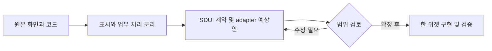

# KMovement — SDUI 위젯 후보

목표: 원래 화면의 역할과 코드를 확인하고, 한 위젯씩 분리할 대상을 정한다. 기준: `main` / `566fc5a629b5d8ed07c7e203bd68b87906b8a813`.

여행 추천·장소 탐색과 웹/모바일 SDUI 코드가 함께 있는 큰 저장소다. 이번 기간에는 유지보수 문서 추가이며 기존 기능을 위젯 후보로 추출한다.

공개 범위: 공개. LICENSE 없음; 포함된 하위 프로젝트·데이터·이미지 각각 권리 확인 필요. 후보는 구현 완료나 재배포 허가를 의미하지 않는다.

9/18·19·20 KST 커밋 수: 0 / 2 / 0. 병합·문서 커밋 포함; 기능 수 아님. 일요일은 조사 시점까지만.

|ID|위젯 후보|현재 상태|분리 작업|
|---|---|---|---|
|R05-W01|여행 조건 기반 일정 추천|기존 React 훅 구현; host 전용 플러그인 필요|화면명 KRIDE_FOCUS 결합 제거; 요청취소·새 조건 재조회·API envelope 표준화|
|R05-W02|장소 카드·찜|분리된 React 카드 구현; 낮은 복잡도의 UI 추출 후보|표시모델(title,image,address,badges)+open/toggle 이벤트로 표준화; 실제 저장은 adapter|
|R05-W03|모바일 주소 선택 액션|기존 모바일 액션 구현; 웹과 동일 실행 보장은 아님|주소 입력 공통 계약와 공통 값만 합의; 상세주소·취소·오류 callback 추가 제안|

## R05-W01 · 여행 조건 기반 일정 추천

기간·지역·취향을 받아 일정과 지도 마커 상태를 만든다.

|항목|내용|
|---|---|
|입력|screenId,formData(duration,selectedArtists,selectedRegions,purposes,budget)|
|처리|KRIDE_FOCUS·조건있음·미호출 확인 → requestItinerary; 통신 실패만 1.5초 후 1회 재시도; 장소수 0 오류|
|반환·화면|data(itinerary,markers,mapData),isLoading,error|
|API|POST /kride-api/recommend/itinerary|
|저장|훅 메모리 상태; 원격 저장 여부 이 훅만으로 확정 안 됨|
|부수효과|추천 요청 및 analytics 이벤트|
|보안·분리 경계|위치·취향/분석 이벤트 동의; timeout 120초와 비용 제한 필요|
|공통화 계열|추천 결과 카드|
|구현 후 통과 기준|통신/HTTP/빈일정 오류 구분, unmount·새 조건, 마커 누락|

핵심 코드:
- [export function useKrideItinerary · subproject/SDUI/metadata-project/components/DynamicEngine/hook/useKrideItinerary.ts:67](https://github.com/feed-mina/KMovement/blob/566fc5a629b5d8ed07c7e203bd68b87906b8a813/subproject/SDUI/metadata-project/components/DynamicEngine/hook/useKrideItinerary.ts#L67)
- [async function requestItinerary · subproject/SDUI/metadata-project/components/DynamicEngine/hook/useKrideItinerary.ts:25](https://github.com/feed-mina/KMovement/blob/566fc5a629b5d8ed07c7e203bd68b87906b8a813/subproject/SDUI/metadata-project/components/DynamicEngine/hook/useKrideItinerary.ts#L25)

## R05-W02 · 장소 카드·찜

여행 장소의 사진·주소·추천 이유와 저장 상태를 표시한다.

|항목|내용|
|---|---|
|입력|TourPoi,isSaved,priority,onOpen,onToggleSave|
|처리|TourPoiCard 표시 → 상세 콜백/찜 콜백; TourExploreScreen은 찜 id Set 관리|
|반환·화면|카드 JSX와 contentId 이벤트|
|API|카드 자체 없음; 상위 fetchTourPois GET /api/v1/tour/poi|
|저장|상위 localStorage kride:saved-pois|
|부수효과|상위 찜 저장과 분석 이벤트|
|보안·분리 경계|사진 이용권·외부 링크 안전성; 개인 찜 동기화는 사용자별 저장으로 별도 설계|
|공통화 계열|장소/목록 카드|
|구현 후 통과 기준|빈 이미지·주소·contentId, 긴 제목·추천이유, 키보드 상세/찜 조작|

핵심 코드:
- [export default function TourPoiCard · subproject/SDUI/metadata-project/components/plugins/travel/TourPoiCard.tsx:17](https://github.com/feed-mina/KMovement/blob/566fc5a629b5d8ed07c7e203bd68b87906b8a813/subproject/SDUI/metadata-project/components/plugins/travel/TourPoiCard.tsx#L17)
- [const toggleSave · subproject/SDUI/metadata-project/components/plugins/travel/TourExploreScreen.tsx:371](https://github.com/feed-mina/KMovement/blob/566fc5a629b5d8ed07c7e203bd68b87906b8a813/subproject/SDUI/metadata-project/components/plugins/travel/TourExploreScreen.tsx#L371)
- [export async function fetchTourPois · subproject/SDUI/metadata-project/services/tourApi.ts:56](https://github.com/feed-mina/KMovement/blob/566fc5a629b5d8ed07c7e203bd68b87906b8a813/subproject/SDUI/metadata-project/services/tourApi.ts#L56)

## R05-W03 · 모바일 주소 선택 액션

플랫폼 주소 검색창 결과를 폼에 채운다.

|항목|내용|
|---|---|
|입력|OPEN_POSTCODE action, NavigationAdapter.openPostcode|
|처리|provider callback의 zipCode/roadAddress를 base.setFormData에 병합|
|반환·화면|폼 상태 갱신; 별도 반환 데이터 없음|
|API|검색은 NavigationAdapter 제공자에 위임|
|저장|폼 상태; 회원가입 저장은 별도 REGISTER_SUBMIT|
|부수효과|주소검색창 호출·상태 갱신|
|보안·분리 경계|주소 provider 권한·개인정보 유지; 로그인/가입 로직 전체를 공용 위젯에 넣지 않기|
|공통화 계열|주소 입력|
|구현 후 통과 기준|선택·취소·provider 부재, 기존 상세주소 보존, 웹/모바일 값 매핑|

핵심 코드:
- [case "OPEN_POSTCODE" · subproject/SDUI/kride/packages/core/src/hooks/useBusinessActions.ts:258](https://github.com/feed-mina/KMovement/blob/566fc5a629b5d8ed07c7e203bd68b87906b8a813/subproject/SDUI/kride/packages/core/src/hooks/useBusinessActions.ts#L258)

## 예상 작업 순서

이번 조사: 정적 소스 확인. 앱 실행·운영 API·실제 고객 화면 동등성은 검증하지 않았다. 위 흐름은 향후 작업 계획이며 현재 앱 호출 흐름이 아니다.
