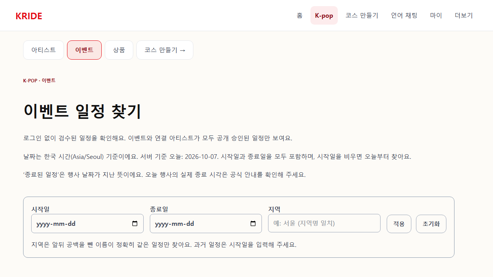
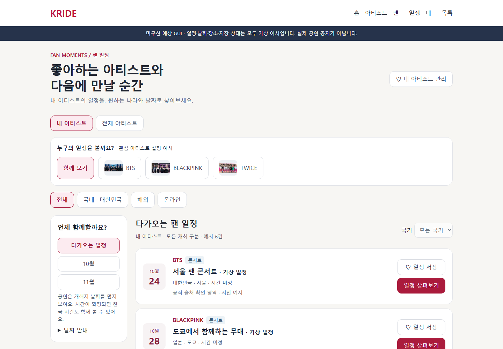
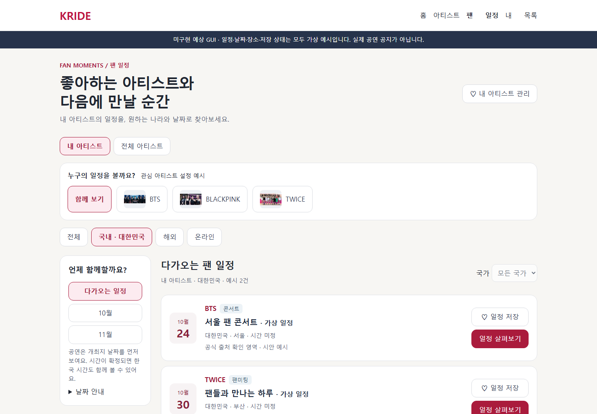
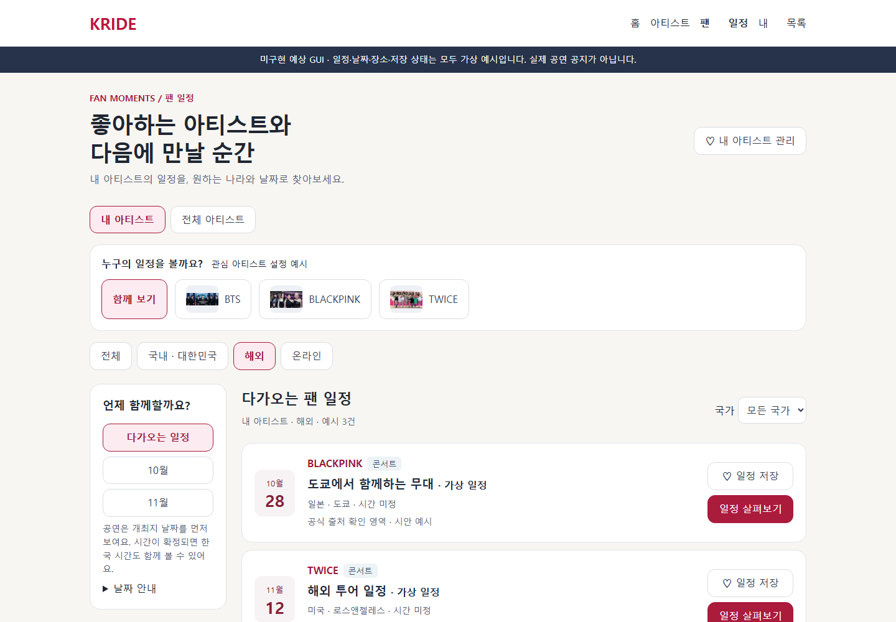
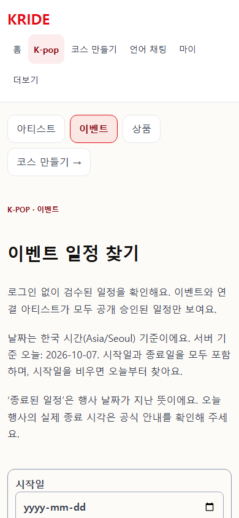
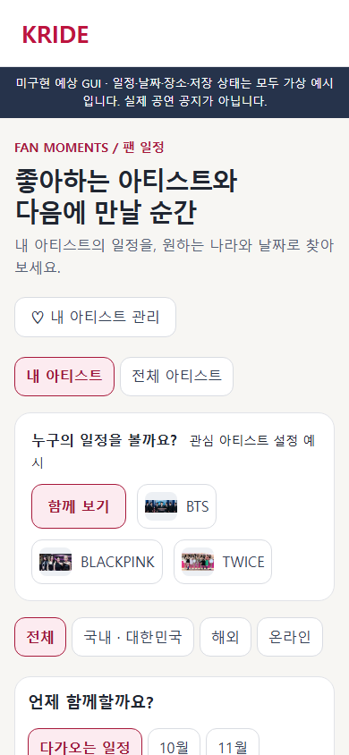

# 팬 일정 · 조사 작업 지도
목표: 관심 아티스트와 국내·해외·온라인 구분을 중심으로 일정 탐색을 설계한다.

1. 현재 운영 화면과 공개 응답을 읽기 전용으로 확인했다.
2. 공식 서비스3개의 탐색 방식을 비교하고 예상 GUI를 만들었다.
3. 서비스 구현·운영 데이터 변경·배포는 하지 않았다.

조사 완료 → 분류·개인화 원인 확인 → 예상 GUI 완료 → 시안 동작 확인 → 사용자 시안 검토 → 후속 구현 명세.

확인: 기본 공개 일정90건·16개 아티스트. region에는 도시·국가/지역·온라인이 혼재. 내 아티스트 UI 없음. 기존 artist_follow 저장 관계 재사용 가능.
제안: 내/전체 아티스트 → 개최 구분 → 국가·날짜 → 날짜순 목록 → 출처와 저장. 날짜만 있는 해외 자료를 자동 시각 변환하지 않는다.
완료: PC·모바일 운영 캡처, 국내·해외·모바일 예상 화면, 클릭 가능한 가상 시안.
미실행: 실데이터 국가·시간대 검수, 실제 개인 피드, 두 계정·시간대 테스트, 팬 인터뷰, 코드 수정·배포.
다음 행동: 시안에서 관심 아티스트의 해외 일정을 찾는 흐름 검토. 사용자 터미널 작업 없음.

## 화면 자료
Before: 이번 운영 실제 캡처. After: 미구현 예상 GUI이며 모든 일정·날짜·장소·관심 설정은 가상 예시입니다.

