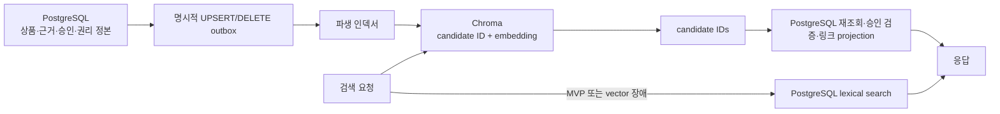

# K-POP 상품 후보 검색: PostgreSQL 원본과 파생 벡터 인덱스 운영 계약

> 대상: GitHub issue #171 (`Product candidate / search`)
>
> 상태: 실행 계약 확정안 (2026-07-23)
>
> 범위: 상품 후보 검색, 권리/승인 필터, SavedItem 참조, 파생 Chroma 인덱스의 생성·무효화·복구

## 1. 결론

1. **PostgreSQL이 유일한 source of truth다.** 상품명, 브랜드, 근거 등급, 링크, 권리 확인, 승인 상태와 저장 항목은 PostgreSQL에서만 확정한다.
2. **#171 MVP 검색은 PostgreSQL lexical search로 제공한다.** Chroma 가용 여부가 MVP 배포 조건이 되어서는 안 된다.
3. **Chroma는 이후 단계의 파생 인덱스다.** 레코드에는 `product_candidate_id`를 식별자로 쓰고 embedding만 저장한다. 상품명, 링크, 근거, 승인·권리 상태를 Chroma에 복제하지 않는다.
4. **벡터 검색 결과는 반드시 PostgreSQL에서 다시 검증한다.** 존재하지 않거나 변경된 ID, `approved_yn != 'Y'`인 행은 폐기한다. `rights_checked != TRUE`인 후보는 이름·근거는 표시할 수 있지만 공식 링크는 반드시 숨긴다.
5. **Chroma 장애, 유효 후보 0건, stale ID 과다 발생 시 PostgreSQL lexical search로 대체한다.** 벡터 인덱스 장애 때문에 빈 성공 응답을 만들지 않는다.
6. **TTL로 정합성을 맞추지 않는다.** 승인·검색 대상 필드는 명시적 UPSERT/DELETE, 권리 상태는 링크/응답-cache invalidation으로 반영하고, 전체 재색인 및 대사(reconciliation)로 누락을 복구한다.

아래 그림은 목표 상태다. 실선으로 그린 vector write/read path도 Gate B가 끝나기 전에는 구현된 것으로 보지 않으며, MVP 요청은 lexical path만 사용한다.



## 2. 현행 코드 앵커와 확인된 간극

### 2.1 PostgreSQL 및 K-POP API

- [V82 K-POP Phase 0 migration](../subproject/SDUI/SDUI-server/src/main/resources/db/migration/V82__kpop_phase0.sql)은 `artist`, `event`, `product_candidate`, `saved_item`을 생성한다.
- 같은 migration의 `product_candidate`에는 `product_candidate_id`, `artist_id`, `event_id`, `name`, `brand`, baseline `evidence_grade`/`confidence`/`evidence_text`, `official_url`, `approved_yn`, `updated_at`이 있다.
- [V85 product catalog migration](../subproject/SDUI/SDUI-server/src/main/resources/db/migration/V85__kpop_product_catalog_and_saved_items.sql)은 출처·권리 확인 필드와 분석 실행별 `kpop_analysis_candidate` 관계를 추가하는 #171 구현 앵커다. 파일 존재와 실제 대상 DB 적용·검증은 별도 gate다.
- [KpopController](../subproject/SDUI/SDUI-server/src/main/java/com/domain/demo_backend/domain/kpop/controller/KpopController.java)의 `productCandidates`는 PostgreSQL을 직접 조회하고 `approved_yn = 'Y'`를 적용한다. Phase 0 시점에는 `artistId` 필터만 있고 검색어 기반 lexical search 계약은 아직 완성되지 않았다.
- [KpopProductService](../subproject/SDUI/SDUI-server/src/main/java/com/domain/demo_backend/domain/kpop/service/KpopProductService.java)는 이번 #171 worktree에서 `q`/artist/event/limit lexical query, 권리 기반 URL projection, SavedItem hydration, worker candidate 재검증을 구현하는 앵커다. 이 파일의 존재만으로 완료로 보지 않고 migration·집중 테스트 결과를 함께 요구한다.
- 같은 controller의 `saveItem`/`savedItems`는 사용자 소유 `saved_item`을 PostgreSQL에 기록·조회한다. SavedItem은 Chroma ID나 순위를 저장하는 계층이 아니다.
- [K-POP Phase 0 plan](../.ai/impl/20260722_kpop_phase0_plan.md)의 C-3과 P3는 PostgreSQL source-of-truth 및 파생 vector index 원칙을 이미 선택했지만, 상품 후보 전용 재색인·무효화 구현은 열린 항목으로 남아 있다.

### 2.2 기존 Chroma·임베딩 스택

- [rag_client.py](../src/api/rag_client.py)의 `get_chroma`는 `CHROMA_MODE`에 따라 `PersistentClient` 또는 `HttpClient`를 사용한다.
- 같은 파일의 `COLLECTION_MAP`과 `search_pois_by_purpose`는 `kride_poi_*` POI 컬렉션을 검색하며, 상품 후보 전용 컬렉션을 사용하지 않는다.
- 같은 파일의 `_query_collection`은 컬렉션 연결/조회 예외를 빈 배열로 바꾼다. 이 동작만으로는 “실제 검색 결과 0건”과 “Chroma 장애”를 구분할 수 없다.
- [torchserve_client.py](../src/api/torchserve_client.py)의 `embed_texts_sync`는 TorchServe의 `embedder` endpoint를 호출하고, 설정에 따라 로컬 SentenceTransformer로 대체한다. 기본 모델은 `intfloat/multilingual-e5-small`이다.
- [embedder_handler.py](../torchserve/handlers/embedder_handler.py)의 handler도 같은 모델을 사용하고 정규화된 embedding을 생성한다.
- [build_poi_collections.py](../scripts/build_poi_collections.py)는 Neo4j POI를 목적별 Chroma 컬렉션으로 만들고 `upsert`한다. 시작 시 기존 컬렉션을 삭제·재생성하며 상품 후보 승인/권리 필터와 증분 삭제 계약은 없다.
- [load_chroma_from_colab.py](../scripts/load_chroma_from_colab.py) 역시 `kride_poi_full`을 삭제·재생성하고 상품 메타데이터를 Chroma에 복제한다. 이는 이 문서의 K-POP 상품 후보 계약에 재사용하지 않는다.

### 2.3 현재 구현으로 간주하지 않는 항목

다음은 이 문서에서 계약하지만, 전용 코드·migration·테스트가 합쳐지고 검증되기 전에는 “구현 완료”로 간주하지 않는다.

- `q` 기반 상품 후보 lexical search 및 페이지 제한
- 상품 후보의 승인 필터, `rights_checked` 기반 링크 공개 필터, 출처/최종 검증 시각 관리
- K-POP 상품 후보 전용 Chroma 컬렉션
- DB 변경 후 증분 UPSERT/DELETE outbox와 worker
- 인덱스 상태 ledger, 전체 재색인, stale ID 대사
- Chroma 장애를 구분하는 metric과 lexical fallback 증거
- `multilingual-e5-small`의 정확한 artifact revision/checksum과 embedding 차원 호환성 고정

## 3. 데이터 소유권 계약

| 데이터 | 진실 원천 | 파생 저장 허용 | 공개 응답 조건 |
| --- | --- | --- | --- |
| 상품 후보 식별자 | `product_candidate.product_candidate_id` | Chroma record ID | PG 행이 현재 존재해야 함 |
| 상품명·브랜드 | PostgreSQL | embedding 생성 시 메모리에서만 사용 | 후보가 승인 상태여야 함 |
| artist/event 연결 | PostgreSQL FK | Chroma 저장 금지 | 연결 대상도 공개 가능한 상태 |
| catalog baseline evidence | PostgreSQL `product_candidate` | Chroma 저장 금지 | 목록/기본 후보 설명에 사용 |
| 분석 실행별 grade/confidence/evidence/rank | PostgreSQL `kpop_analysis_candidate` | Chroma 저장 금지 | job 소유권 확인 후 해당 분석 결과로 직렬화 |
| `official_url`/`source_url` | PostgreSQL | Chroma·embedding 저장 금지 | `official_url`은 `rights_checked = TRUE`일 때만 공개; `source_url`은 K-POP 상품 API에 공개 금지 |
| 승인·권리 상태 | PostgreSQL | Chroma 저장 금지 | 후보 행은 `approved_yn = 'Y'`; 링크는 추가로 `rights_checked = TRUE` |
| SavedItem | PostgreSQL `saved_item` | Chroma 저장 금지 | 사용자 소유권 + 현재 후보 승인 상태 재검증; 링크는 권리 상태에 따라 projection |
| embedding | 파생 계산물 | Chroma | 직접 공개 금지 |

### 3.1 후보 노출과 링크 노출 조건

검색·분석 결과·SavedItem 상세에 후보 이름과 근거를 노출할 수 있는 행은 최소한 다음을 만족해야 한다.

- `product_candidate` 행이 존재한다.
- `approved_yn = 'Y'`다.
- 요청한 artist/event 필터가 있으면 PostgreSQL FK 값이 일치한다.
- evidence grade가 정의된 enum 중 하나이고 confidence가 허용 범위 안이다.

`rights_checked = FALSE`여도 승인된 후보의 이름, 브랜드, 근거 등급은 표시하고 저장할 수 있다. 다만 `official_url`은 SQL projection에서 `NULL`로 만들며 `source_url`은 운영 근거로만 보존하고 K-POP 상품 API에는 절대 직렬화하지 않는다. 공식 링크가 있는 후보만 찾는 `linkEligibleOnly=true` 필터는 future option이며 #171 MVP API에 포함하지 않는다. 향후 도입하면 `rights_checked = TRUE`를 SQL 행 조건에 추가한다.

권리 확인 시각의 유효기간 정책은 아직 정해지지 않았다. 향후 만료 정책을 추가하더라도 TTL에 맡기지 않고 PostgreSQL 권리 상태와 응답 cache를 명시적으로 invalidation한다. 권리 미확인 후보 전체를 숨기는 정책은 별도 future option이며, 채택 전에는 현재의 “후보는 표시, 링크만 숨김” 계약을 바꾸지 않는다.

### 3.2 baseline evidence와 분석 실행별 evidence

- `product_candidate.evidence_grade`/`confidence`/`evidence_text`는 catalog에 붙은 baseline 근거다.
- worker가 특정 분석 job에서 만든 rank, grade, confidence, evidence는 `kpop_analysis_candidate`에 job별로 저장한다.
- 분석 결과를 표시할 때 rank/grade/confidence/evidence는 `kpop_analysis_candidate` 값을 사용하고, 상품 identity/name/brand/link/현재 승인·권리 상태는 `product_candidate`를 다시 join해 사용한다.
- worker가 보낸 상품명이나 URL은 정본으로 승격하지 않는다. worker의 candidate ref가 현재 승인된 PG 상품을 가리키지 않으면 결과에서 제외한다.

## 4. #171 MVP: PostgreSQL lexical search

### 4.1 API 계약

기존 공개 endpoint `GET /api/v1/kpop/product-candidates`를 확장한다.

| 파라미터 | 규칙 |
| --- | --- |
| `q` | 선택, trim 후 최대 120자. 빈 문자열은 미지정과 동일. name/brand의 대소문자 무시 부분 일치 |
| `artistId` | 선택, 양의 정수, PG에서 일치 검증 |
| `eventId` | 선택, 양의 정수, PG에서 일치 검증 |
| `limit` | 기본 20. 1 미만은 거부하고 50 초과는 50으로 제한 |

MVP 정렬은 `confidence DESC, product_candidate_id DESC`로 고정한다. 검색어가 있어도 같은 정렬을 유지하며 ID tie-break로 결과 순서를 결정적으로 만든다. exact/prefix 가중치나 전문 검색 순위는 품질 측정 후 별도 future 개선으로 다룬다.

모든 쿼리는 `approved_yn = 'Y'`를 SQL 자체에 포함한다. Java에서 조회 후 승인 필터를 적용하는 방식만 사용해서는 안 된다. `officialUrl`은 SQL의 `CASE WHEN rights_checked = TRUE THEN official_url ELSE NULL END`와 동등한 fail-closed projection으로 반환하고 `sourceUrl`은 모든 K-POP 상품 API 응답에서 제거한다. future `linkEligibleOnly=true`를 도입할 때만 행 조건에도 `rights_checked = TRUE`를 추가한다.

### 4.2 MVP 장애 의미

- PostgreSQL 조회 성공·결과 0건: HTTP 200 + 빈 목록.
- 잘못된 필터/enum/길이: HTTP 400.
- PostgreSQL 연결 실패: HTTP 5xx. 빈 목록으로 바꾸지 않는다.
- MVP에는 Chroma 호출이 없으므로 Chroma 장애가 응답에 영향을 주지 않는다.

### 4.3 SavedItem 재검증

- 저장 요청의 `itemType = PRODUCT_CANDIDATE`는 실제 PG 후보가 존재하고 현재 사용자에게 노출 가능한지 확인한 뒤 기록한다.
- 저장 목록 조회 시 상품 후보를 PG와 join하여 승인 상태를 다시 확인하고 링크를 현재 권리 상태로 projection한다.
- 저장 목록은 소유자 기준 최신순 최대 100건으로 제한한다.
- 저장 뒤 비승인이 된 후보는 상세 데이터를 노출하지 않고 SavedItem의 `item`을 `{ "available": false }` tombstone으로 반환한다. 저장 행 자체는 사용자가 삭제하거나 운영 보존 정책이 처리할 때까지 유지한다.
- 저장 뒤 권리가 철회된 승인 후보는 SavedItem과 이름·근거를 유지하되 `officialUrl`을 즉시 `null`로 반환한다.
- Chroma 검색 결과나 순위를 SavedItem의 참조값으로 사용하지 않는다.

## 5. Future gate: 파생 Chroma 인덱스

### 5.1 컬렉션 계약

- 논리 namespace: `kride_kpop_product_candidate_v1`.
- `v1`은 임베딩 입력 projection/차원/거리 함수 계약 버전이다. 배포 시각이나 TTL 버전이 아니다.
- 기본 임베딩 후보: 현재 스택의 `intfloat/multilingual-e5-small`, normalized vector, cosine distance.
- vector read path를 켜기 전 모델 artifact revision/checksum과 출력 차원을 고정한다. 모델 이름만 같은 서로 다른 artifact를 같은 collection에 섞지 않는다.
- Chroma record ID: `product_candidate:{product_candidate_id}`.
- record payload: **ID + embedding만**. `documents`와 per-record `metadatas`에 상품명, 링크, evidence, 승인/권리 값을 넣지 않는다.
- 모델 ID, 차원, distance, projection version, 활성 physical collection은 PostgreSQL index registry 또는 배포 설정에서 관리한다. Chroma 행을 정본으로 사용하지 않는다.

embedding 입력 문장은 PostgreSQL의 승인된 행으로부터 worker 메모리에서 일시적으로 만든다. 허용 필드는 정규화한 name, brand, artist name, event title과 catalog baseline evidence 요약이다. 분석 job별 evidence, URL, 사용자 데이터, 원본 업로드 경로는 포함하지 않는다.

### 5.2 명시적 invalidation

TTL은 정합성 장치가 아니다. 다음 PostgreSQL 변경은 canonical transaction과 같은 경계에서 outbox 이벤트를 남겨야 한다.

| 변경 | 이벤트 | Chroma 처리 |
| --- | --- | --- |
| 검색 가능 후보 생성 | `UPSERT(candidate_id, canonical_updated_at)` | PG 재조회 → embedding → ID upsert |
| name/brand/artist/event/evidence 검색문 변경 | `UPSERT` | 기존 ID의 embedding 교체 |
| 승인 `Y` 전환 | `UPSERT` | 공개 조건 재검증 후 upsert |
| 승인 철회, soft/hard delete | `DELETE` | 정확한 record ID 삭제 |
| 권리 확인/철회 | `LINK_INVALIDATE` | PG 응답 cache를 제거; Chroma는 링크를 저장하지 않으므로 행 유지 |
| 모델/projection version 변경 | `FULL_REINDEX_REQUIRED` | staging 전체 재색인 후 명시적 전환 |

outbox와 index ledger는 아직 존재하지 않는 future migration 대상이다. 최소 상태는 `candidate_id`, operation, canonical version(`updated_at` 또는 단조 증가 version), attempts, last_error, processed_at이다. ledger에는 content hash, model/projection version, indexed canonical version, indexed_at을 기록한다. 이 정보는 Chroma metadata가 아니라 PostgreSQL에서 감사·대사한다.

worker는 이벤트를 여러 번 받아도 안전해야 한다. UPSERT는 동일 ID 덮어쓰기, DELETE는 이미 없는 ID에도 성공으로 처리한다. 같은 ID의 오래된 이벤트가 최신 이벤트 뒤에 도착하면 canonical version을 비교해 무시한다.

### 5.3 벡터 조회와 PG 재검증

벡터 검색을 켠 뒤의 서버 알고리즘은 다음 순서를 고정한다.

1. 검색어를 검증하고 embedding을 계산한다.
2. Chroma에서 top-N ID와 distance만 받는다. 실패와 정상 0건을 서로 다른 상태로 기록한다.
3. ID 형식을 allowlist(`product_candidate:<positive-long>`)로 검증한다.
4. 한 번의 PostgreSQL 쿼리로 후보를 다시 조회한다.
5. `approved_yn = 'Y'`, 요청 필터, index ledger의 검색 projection version/hash 일치를 SQL에서 검증한다. future `linkEligibleOnly=true`가 도입되면 그 요청에만 `rights_checked = TRUE`를 행 필터에 추가한다.
6. 누락·비승인·검색 projection hash 불일치 행은 stale로 간주해 벡터 결과에서 제거하고 DELETE/UPSERT 복구 이벤트를 발행한다. 권리 상태만 바뀐 후보는 stale embedding이 아니며 PG projection으로 링크를 즉시 숨기거나 공개한다.
7. 남은 행만 Chroma distance 순서로 반환하되 모든 표시 데이터는 PG 값을 사용한다.
8. Chroma 장애, 유효 후보 0건 또는 제거율이 임계치를 넘으면 동일 요청을 PG lexical search로 처리한다. 일부만 유효하면 lexical 결과로 페이지를 채우되 ID 중복을 제거한다.

따라서 오래된 Chroma 행이 남아 있어도 철회된 링크는 공개되지 않는다. 상품 identity와 표시 데이터 역시 항상 최신 PG 값을 사용한다. PG 장애 시에는 Chroma만으로 응답하지 않고 실패를 반환한다.

### 5.4 전체 재색인

전체 재색인은 운영자가 실행 ID와 사유를 남겨 시작하며 다음 단계를 모두 수행한다.

1. PG에서 재색인 기준 시각과 활성 모델/projection version을 고정한다.
2. 검색 가능 조건을 만족하는 ID와 embedding projection을 keyset pagination으로 읽는다.
3. 임시 physical collection에 배치 upsert한다. 실패 배치는 재시도하고 영구 실패 ID를 보고한다.
4. 기준 시각 이후 outbox 이벤트를 임시 collection에 순서대로 replay한다.
5. `PG eligible IDs - Chroma IDs`는 누락으로, `Chroma IDs - PG eligible IDs`는 stale로 계산한다.
6. 누락은 upsert하고 stale ID는 명시적으로 삭제한다.
7. count, ID set checksum, 임의 표본의 embedding 차원, 비승인 fixture 부재를 검증한다. 별도로 권리 미확인 fixture의 Chroma record에는 URL/메타데이터가 없고 API 링크가 null인지 확인한다.
8. 검증 성공 시 active physical collection 포인터를 한 번에 전환한다. 실패 시 기존 collection을 유지한다.
9. 전환 뒤 관찰 기간이 지나면 이전 physical collection을 명시적으로 삭제한다.

임시 collection 이름에 run ID를 쓸 수 있지만 이는 원자적 재색인을 위한 staging일 뿐, namespace 회전이나 TTL을 invalidation 대신 사용하는 것이 아니다.

### 5.5 증분 upsert 및 stale 삭제 대사

- 정상 경로: outbox lag와 실패 건수를 지속 관찰하고 각 변경을 수 초~수 분 내 반영한다.
- 정기 대사: PG eligible ID set과 Chroma ID set을 비교한다. 누락은 UPSERT, 초과는 DELETE한다.
- version 대사: PG `updated_at`/version이 ledger보다 최신이면 UPSERT한다.
- 승인 대사: 비승인 ID가 Chroma에 있으면 우선 DELETE하고 보안성 metric으로 집계한다. 권리 미확인 ID는 허용하되 API 링크 노출 여부를 별도로 감사한다.
- 대사 성공은 count 일치만으로 판단하지 않는다. ID set 차이와 version/hash 차이가 0이어야 한다.

## 6. 관측성과 실패 정책

최소 metric/log 필드는 다음과 같다. 원문 검색어, source URL, 사용자 업로드 key는 로그에 남기지 않는다.

- `kpop_search_mode_total{mode=lexical|vector|lexical_fallback}`
- `kpop_vector_query_failure_total{reason}`
- `kpop_vector_candidate_total`, `kpop_vector_candidate_stale_total`
- `kpop_vector_outbox_lag_seconds`, `kpop_vector_outbox_failure_total`
- `kpop_vector_reconcile_missing`, `kpop_vector_reconcile_stale`, `kpop_vector_reconcile_version_drift`
- `kpop_vector_reindex_run{status}`, 처리 count, 실행 ID, model/projection version

알림 기준의 초안은 다음과 같다.

- Chroma query 실패율 또는 lexical fallback 비율이 5분 동안 임계치를 초과한다.
- outbox 최장 지연이 운영 SLO를 초과한다.
- 비승인 ID가 Chroma에서 발견되거나, 권리 미확인 후보의 공식 링크가 API에서 노출된다.
- 재색인 후 ID set 또는 version/hash 차이가 0이 아니다.

## 7. 구현 순서

### Gate A — #171 MVP (필수)

1. product catalog에 출처, 권리 확인, 최종 검증 시각 필드를 migration으로 추가한다.
2. phase-0 seed의 링크를 자동으로 권리 확인된 것으로 간주하지 않는다.
3. PostgreSQL lexical search와 입력 allowlist/limit을 구현한다.
4. SQL에서 승인 조건과 권리 기반 링크 projection을 fail-closed로 적용한다. `linkEligibleOnly`는 future option으로 남긴다.
5. 분석 결과 candidate ref와 SavedItem을 PG FK/소유권으로 검증한다.
6. backend 테스트와 실제 PostgreSQL migration 적용을 검증한다.

### Gate B — 파생 벡터 read path (future)

1. 상품 후보 전용 index registry/outbox/ledger를 migration으로 추가한다.
2. 전용 인덱서와 `ID + embedding` Chroma collection을 구현한다.
3. vector IDs → PG 재조회 → rights/approved/version 필터 → lexical fallback을 구현한다.
4. Chroma 장애/빈 결과/stale ID 테스트와 metric을 추가한다.
5. feature flag로 내부 트래픽부터 켜고 lexical 결과 품질과 비교한다.

### Gate C — 운영 재색인 (future)

1. staging full reindex, outbox replay, ID/version 대사, 원자적 active 전환을 구현한다.
2. 운영 runbook, 실패 rollback, 이전 collection 삭제 절차를 추가한다.
3. 승인 철회 긴급 DELETE, 권리 철회 응답-cache invalidation, 정기 reconciliation을 자동화한다.

## 8. 검증 명령

아래 명령은 구현 후 실행할 계약 검증 예시다. 아직 만들어지지 않은 테스트 이름은 future gate에 속하며, 존재하기 전에는 성공 증거로 인용하지 않는다.

### 8.1 현행 앵커 확인

```powershell
rg -n "CREATE TABLE IF NOT EXISTS product_candidate|approved_yn|rights_checked|saved_item" subproject/SDUI/SDUI-server/src/main/resources/db/migration
rg -n "productCandidates|approved_yn|rights_checked|saveItem|savedItems" subproject/SDUI/SDUI-server/src/main/java/com/domain/demo_backend/domain/kpop
rg -n "CHROMA_MODE|COLLECTION_MAP|search_pois_by_purpose|embed_texts_sync" src/api/rag_client.py src/api/torchserve_client.py
```

### 8.2 MVP backend 검증

```powershell
cd subproject/SDUI/SDUI-server
.\gradlew.bat test --tests "*KpopControllerTest" --tests "*KpopProduct*Test"
```

fixture/assertion은 최소한 다음을 포함한다.

- name/brand 대소문자 무시 substring 검색과 `confidence DESC, id DESC` deterministic 정렬
- q 120자 제한, 양의 artist/event ID, limit 하한 거부·상한 50 제한
- `approved_yn = 'N'` 후보 미노출
- `rights_checked = FALSE` 승인 후보는 이름·근거가 노출되지만 `officialUrl`은 null
- 잘못된 enum/limit/ID는 400
- 다른 사용자의 SavedItem 접근 차단
- 저장 뒤 비승인된 참조는 `item.available = false` tombstone
- 저장 후 권리 철회된 승인 후보는 유지되지만 링크는 즉시 null
- evidence 부족 시 `INSUFFICIENT_EVIDENCE` 유지

### 8.3 Future vector 검증

```powershell
python -m pytest tests/test_kpop_vector_index.py -q
python -m pytest tests/test_kpop_vector_reindex.py -q
```

future 테스트는 최소한 다음을 증명해야 한다.

- Chroma record가 ID와 embedding 외 상품 메타데이터를 갖지 않는다.
- stale/nonexistent ID를 PG 재검증에서 폐기한다.
- 승인 철회 직후 DELETE 이벤트가 생성되고, 반영 전에도 API가 행을 노출하지 않는다.
- 권리 철회 직후 링크/cache invalidation이 생성되고, Chroma 반영과 무관하게 API가 `officialUrl`을 노출하지 않는다.
- Chroma timeout/연결 실패/정상 0건을 구분하고 PG lexical fallback한다.
- out-of-order 이벤트가 최신 embedding을 되돌리지 않는다.
- 전체 재색인이 누락 upsert와 stale delete를 모두 수행한다.
- 재색인 검증 실패 시 active collection이 바뀌지 않는다.

## 9. 완료 조건

### #171 MVP 완료

- [x] 상품 후보의 출처·권리·승인 상태가 PostgreSQL에 저장되고 migration이 실제 PostgreSQL에서 적용된다.
- [x] `GET /api/v1/kpop/product-candidates`가 PG lexical search, allowlist, page limit을 제공한다.
- [x] 공개 쿼리가 `approved_yn = 'Y'`를 SQL에서 강제하고 `officialUrl`은 현재 `rights_checked` 값으로 fail-closed projection한다.
- [x] 응답 데이터와 링크는 PG 값만 사용하며 권리 미확인 링크가 노출되지 않는다.
- [x] 분석 결과 candidate ref와 SavedItem이 PG 후보 및 사용자 소유권을 재검증한다.
- [x] evidence 부족 결과가 정확한 상품으로 과장되지 않는다.
- [x] 집중 backend 테스트와 migration 검증이 통과한다.

### 파생 vector gate 완료

- [ ] 상품 후보 전용 Chroma에 ID+embedding만 저장된다.
- [ ] 모든 vector hit가 PG에서 존재·승인·검색 projection version을 재검증하고 링크는 현재 권리 상태로 projection한다.
- [ ] Chroma 장애 및 stale hit에 PG lexical fallback이 동작한다.
- [ ] 증분 UPSERT/DELETE, outbox 재시도, version guard가 동작한다.
- [ ] 전체 재색인, 누락 upsert, stale 삭제, active 전환/rollback이 검증된다.
- [ ] TTL 없이 명시적 invalidation과 정기 대사로 drift 0을 증명한다.
- [ ] production feature flag를 켜기 전 metric/dashboard/alert와 운영 runbook이 준비된다.
