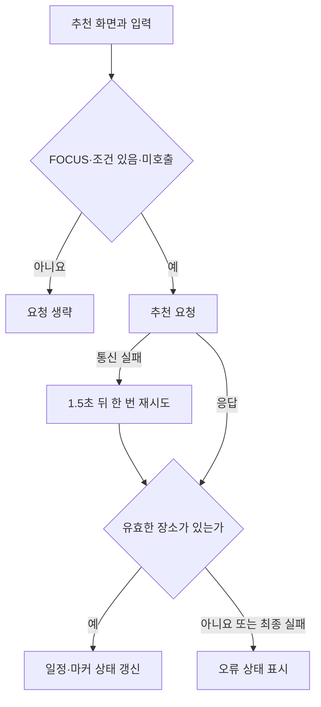

# KMovement — screen-code-handover 업데이트 인수인계

한국시간 2026년 9월 18~19일 업데이트 보고서. 활동 집계 마감은 9월 19일 21:24:15입니다.

여행 조건을 골라 일정·지도·장소를 보여주는 프로젝트입니다. 이번 작업에서는 그 화면이 어떤 코드와 데이터로 이어지는지 정리한 유지보수 문서가 추가됐습니다.

| 항목 | 기준 |
|---|---|
| 보고서 범위 | 이번 기간의 변경과 관련 기능. 전체 시스템 설명은 아래 기존 상세 문서로 연결합니다. |
| 확인 브랜치 | main |
| 소스 기준 | `81638499eb68` |
| 검증 범위 | 이번 커밋의 변경 경로와 기존 인수인계 문서, 추천 훅의 입력·재시도·반환을 정적으로 대조했습니다. |
| 보고서 세트 | [쉬운 설명](easy-guide.md) · [수정·검증 지시](fix-guide.md) · [코드 인수인계](screen-code-handover.md) |

## 이번 변경의 경계

- 9월 19일 09:51, 유지보수 Markdown과 화면·도식 자산을 추가했습니다. 이 기간의 확인된 변경은 문서이며 애플리케이션 기능 변경은 아닙니다.
- 여행 조건 선택, 추천, 지도·채팅, 장소·상품·커뮤니티와 운영 절차를 하나의 문서에서 찾을 수 있습니다.

기존 유지보수 문서에 수록된 추천 화면 설명 이미지입니다. 이번 작업에서 새로 실행·캡처한 화면은 아닙니다.

## 핵심 파일과 역할

| 핵심 파일 | 함수·컴포넌트 | 담당 역할 |
|---|---|---|
| [handover/KMovement-maintenance.md](https://github.com/feed-mina/KMovement/blob/81638499eb683eff3605b6097d67bf03752eccc0/handover/KMovement-maintenance.md) | 화면별 설명 | 10개 화면과 처리·데이터·운영 절차를 연결합니다. 이번 커밋의 주된 산출물입니다. |
| [subproject/SDUI/metadata-project/components/DynamicEngine/hook/useKrideItinerary.ts](https://github.com/feed-mina/KMovement/blob/81638499eb683eff3605b6097d67bf03752eccc0/subproject/SDUI/metadata-project/components/DynamicEngine/hook/useKrideItinerary.ts) | useKrideItinerary / requestItinerary / toUserMessage | 추천을 요청할 조건과 재시도·오류 메시지를 관리합니다. 반환 상태는 지도·일정 화면이 사용합니다. |

## 입력·처리·반환과 부수 효과

| 담당 기능 | 입력 | 처리와 분기 | 반환·출력 | 별도로 일어나는 변경 |
|---|---|---|---|---|
| useKrideItinerary | screenId, formData | FOCUS이고 기간·아티스트·지역 중 조건이 있으며 아직 호출하지 않았을 때 요청 | {data,isLoading,error} | 상태와 분석 이벤트 갱신 |
| requestItinerary | 요청 body, 타이머 보관 콜백 | POST /kride-api/recommend/itinerary, 120초 제한, 응답 상태 확인 | 응답 JSON 또는 예외 | 네트워크 요청 |
| toUserMessage | 오류 객체 | 통신 실패·빈 일정·서버 오류 구분 | 사용자 안내 문자열 | 없음 |

## 동작 흐름

화살표는 호출·데이터 전달 또는 조건 분기를 뜻합니다. 도식에 없는 운영 연결은 확인되지 않았습니다.

## 데이터와 연결 관계

| 저장·전달 대상 | 주요 값 | 관계와 주의점 |
|---|---|---|
| 화면 입력 | duration, selectedArtists, selectedRegions, purposes, budget | 아티스트·지역 객체에서는 name을 뽑아 요청합니다. |
| 추천 응답 | itinerary, mapData.markers, unresolvedPlaces | 지도와 일정이 같은 응답을 사용합니다. |
| 저장 구조 | 기존 상세 문서의 기능별 ERD | 이번 변경은 DB 마이그레이션을 포함하지 않습니다. ERD는 데이터 관계도입니다. |

## 유지보수와 확인 순서

| 바꾸거나 확인할 것 | 확인 위치와 기준 |
|---|---|
| 조건 변경 | 훅의 hasFormData와 body 생성 부분을 함께 확인합니다. |
| 재시도 변경 | isTransientFailure, RETRY_DELAY_MS, REQUEST_TIMEOUT_MS를 확인합니다. HTTP 오류 전체를 통신 재시도로 확대하지 않습니다. |
| 문서 갱신 | 설명과 화면 번호, 다이어그램 연결을 같이 갱신합니다. |

관련 실행·테스트 명령은 기존 문서의 34~37절에 있습니다. 이번 보고서 작업에서는 로컬 서버, 외부 추천, 배포를 실행하지 않았습니다.

## 검증 결과와 남은 범위

이번 커밋의 변경 경로와 기존 인수인계 문서, 추천 훅의 입력·재시도·반환을 정적으로 대조했습니다.

추천 API의 현재 가동 상태, 실제 여행 응답, 전체 빌드 성공은 이번에 검증하지 않았습니다.

## 기존 상세 문서와 활동 근거

- [전체 유지보수·인수인계](https://github.com/feed-mina/KMovement/blob/81638499eb683eff3605b6097d67bf03752eccc0/handover/KMovement-maintenance.md)

| 한국시간 | 커밋 | 기록된 작업 | 구분 |
|---|---|---|---|
| 09/19 09:51 | [8163849](https://github.com/feed-mina/KMovement/commit/81638499eb683eff3605b6097d67bf03752eccc0) | docs: add KMovement visual maintenance handover | 변경 기록 |
