# KMovement 유지보수 및 인수인계 문서

화면·컴포넌트·API·데이터 구조와 유지보수 절차를 연결한 문서입니다. 기존 확장판 PDF의 39개 항목을 Markdown으로 옮겼습니다.

화면 이미지는 예시 데이터를 사용한 코드 기반 재구성입니다. 실행·검증 명령은 유지보수용 안내입니다.

## 목차

- [01. 유지보수 및 인수인계 문서](#section-01)
- [02. 프런트엔드·백엔드·데이터 저장소의 역할](#section-02)
- [03. 요청 경로에 따라 업무 서버와 추천 서버로 나누기](#section-03)
- [04. 화면 설정을 컴포넌트와 데이터로 조립하는 과정](#section-04)
- [05. 화면 설정이 실제 컴포넌트로 바뀌는 분기](#section-05)
- [06. 여행 기간 선택값을 다음 화면으로 전달](#section-06)
- [07. 기간 버튼의 선택값과 이동 액션 연결](#section-07)
- [08. 아티스트 카드 선택을 추천 조건으로 모으기](#section-08)
- [09. 아티스트 선택·해제·최대 개수를 처리하기](#section-09)
- [10. 지역 선택을 추천 요청의 지역 이름으로 변환](#section-10)
- [11. 지역 칩과 추천 요청의 지역 이름을 연결](#section-11)
- [12. 여행 목적과 예산을 일정 생성 조건으로 전달](#section-12)
- [13. 목적 카드 선택과 예산 화면 이동](#section-13)
- [14. 예산 범위를 보정하고 추천 화면으로 이동](#section-14)
- [15. 추천 일정과 지도 마커를 함께 보여주기](#section-15)
- [16. 지도·일정·채팅이 같은 화면 데이터를 공유하는 구조](#section-16)
- [17. 일정 생성 요청과 추천 처리 이력의 흐름](#section-17)
- [18. 추천 요청의 실행·재시도·완료 조건](#section-18)
- [19. 추천 처리 이력의 저장 조건과 필드 계약](#section-19)
- [20. 채팅 의도에 따라 답변과 일정 갱신을 나누기](#section-20)
- [21. 질문·추천·일정 요청에 따라 채팅을 분기](#section-21)
- [22. 지역·카테고리 선택으로 장소 카드를 바꾸기](#section-22)
- [23. 성지와 일반 장소 조회를 나누는 필터 흐름](#section-23)
- [24. 일반 관광정보와 성지 데이터의 조회 경로](#section-24)
- [25. 성지 스키마의 필드·키·화면 사용 위치](#section-25)
- [26. 상품 검색 결과와 사용자 저장 상태를 합치기](#section-26)
- [27. 상품 검색의 병렬 조회와 저장·해제 처리](#section-27)
- [28. 상품 후보·저장 기록·분석 결과의 연결](#section-28)
- [29. 상품 카탈로그와 분석 후보를 연결하는 ERD](#section-29)
- [30. 커뮤니티 목록과 페이지 이동을 연결](#section-30)
- [31. 게시글 작성·검수 상태·목록 표시의 흐름](#section-31)
- [32. 커뮤니티 글과 첨부 이미지·반응 데이터의 관계](#section-32)
- [33. 게시글·이미지·댓글·반응을 연결하는 ERD](#section-33)
- [34. 유지보수에 필요한 실행 환경과 설정](#section-34)
- [35. 로컬에서 데이터·업무 서버·화면을 시작하기](#section-35)
- [36. 수정 영역에 맞춰 테스트와 빌드를 확인하기](#section-36)
- [37. 배포 전 확인과 이전 버전 복구 준비](#section-37)
- [38. 증상별 확인 순서와 정상 복구 기준](#section-38)
- [39. 화면 증상에서 수정할 로직을 찾는 순서](#section-39)

---

<a id="section-01"></a>

## 01. 유지보수 및 인수인계 문서

KMovement · main · 코드와 화면으로 이해하는 주요 기능

화면에서 시작해 함수의 입력·처리·반환값과 데이터 흐름까지 따라가는 문서

화면 구성 요소와 문구는 코드에서 추출했습니다. 이미지는 예시 데이터를 넣어 설명용으로 배치한 정적 재구성 화면입니다.

| 대상 / 순서 | 활용 방법 | 항목 번호 |
| --- | --- | --- |
| 처음 맡는 개발자 | 전체 계층과 화면 조립 방식을 먼저 이해 | 02–05 |
| 여행 기능 담당자 | 조건 입력 → 일정 생성 → 채팅 → 장소 탐색 | 06–25 |
| 상품·커뮤니티 담당자 | 목록·저장·게시글을 화면과 데이터로 확인 | 26–33 |
| 유지보수 담당자 | 증상에 맞는 함수와 데이터 경로부터 확인 | 34–39 |
| 이번 시각화 범위 | 웹 주요 화면 10개와 주요 컴포넌트 이미지<br>로그인·관리자·모바일 전용 화면은 이번 상세 시각화 범위 밖 | 본문 이미지 |

용어: UI(User Interface, 사용자 화면), API(Application Programming Interface, 프로그램 간 호출 규약), DB(Database, 데이터베이스).

---

<a id="section-02"></a>

## 02. 프런트엔드·백엔드·데이터 저장소의 역할

전체 구조 · 브라우저의 요청이 어느 서버로 가는지 구분

| 계층 | 실제 구성 | 입력과 출력 |
| --- | --- | --- |
| 프런트엔드 | Next.js / React<br>화면 등록 + 공통 렌더러 + 기능별 컨트롤러 | 화면 ID·사용자 조작 → 컴포넌트와 요청 |
| 화면·업무 백엔드 | Java / Spring Boot<br>UiController, TourController, KpopController 등 | 요청·로그인 정보 → 화면 트리 / 업무 데이터 |
| 추천 백엔드 | Python / FastAPI<br>recommend_itinerary, chat_stream 등 | 여행 조건·질문 → 일정·지도 좌표·답변 |
| 서비스 데이터 | ui_metadata / query_master<br>tour_poi / product_candidate / community_post 등 | 화면 설정과 업무 데이터를 테이블로 관리 |
| 추천 데이터·이력 | 목적 기반 검색, 그래프 기반 검색<br>설정에 따른 Supabase 또는 로컬 이력 파일 | 추천 후보 검색과 추천 처리 이력 기록 |
| 브라우저 저장 | kride_form / kride:saved-pois | 여행 선택값 / 저장한 장소 식별자 유지 |

요청 경로: /api/...는 Java 업무 서버로, /kride-api/...는 FastAPI의 /api/...로 전달됩니다. 일부 /api 경로는 Next.js 중계 함수를 거칩니다.

---

<a id="section-03"></a>

## 03. 요청 경로에 따라 업무 서버와 추천 서버로 나누기

전체 구조 · 핵심 파일 의존 관계와 데이터 경계

| 핵심 파일 | 핵심 기능 · 1~2문장 |
| --- | --- |
| next.config.ts | 브라우저의 /api와 /kride-api 요청을 각각 Java 업무 서버와 추천 서버로 전달합니다. |
| KrideChatController.java / fastapi_server.py | 채팅은 업무 서버의 사용 조건 확인을 거칩니다. 추천 서버는 여행 조건을 받아 일정과 장소 좌표를 만듭니다. |

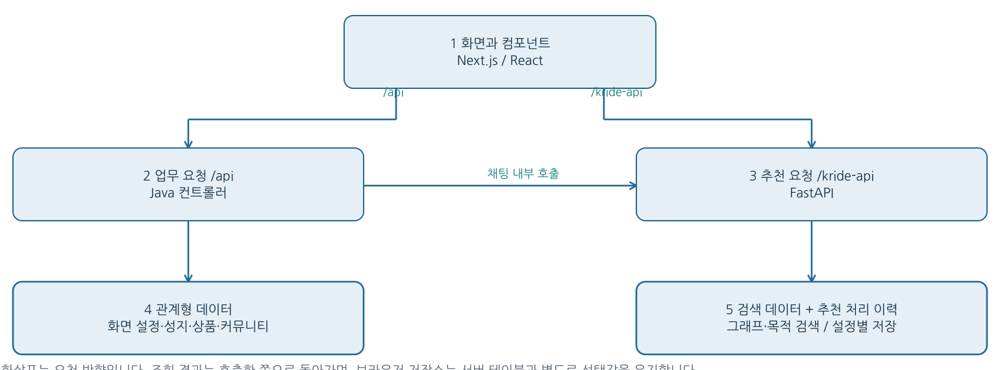

화살표는 요청 방향입니다. 조회 결과는 호출한 쪽으로 돌아가며, 브라우저 저장소는 서버 테이블과 별도로 선택값을 유지합니다.

---

<a id="section-04"></a>

## 04. 화면 설정을 컴포넌트와 데이터로 조립하는 과정

공통 프런트엔드 + 백엔드 · SDUI(Server-Driven User Interface, 서버 설정 기반 화면)

| 단계 / 역할 | 입력과 처리 | 반환 / 사용 위치 |
| --- | --- | --- |
| 1 화면 설정 조회<br>UiService.getUiTree | screenId, userRole → 역할별 필터링 후<br>componentId·parentGroupId로 트리 구성 | UiResponseDto 목록 → 화면 트리 |
| 2 화면 데이터 준비<br>usePageMetadata | 화면 설정의 dataSqlKey 또는 dataApiUrl 조회<br>목록·상세 응답을 refDataId에 연결 | metadata, pageData, loading, totalCount 등 |
| 3 폼과 액션 연결<br>useSduiScreen | screenId, refId, 페이지 조건<br>데이터 훅과 폼·액션 훅을 조합 | formData, handleChange, handleAction 등 |
| 4 화면 요소 생성<br>renderNodes / renderLeaf | 노드 목록과 데이터 → componentType 등록표 확인<br>숨김 항목 생략, 목록 데이터 반복 렌더링 | ReactNode 배열 / ReactNode → 화면 요소 |

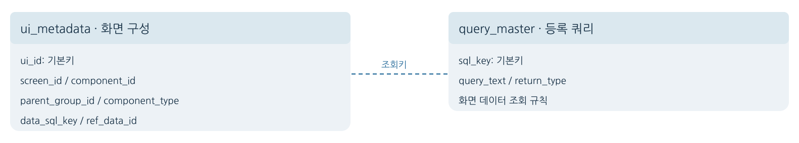

점선은 코드상 연결입니다. data_sql_key는 조회할 쿼리를 고르고, ref_data_id는 반환 데이터를 화면 그룹에 연결합니다.

---

<a id="section-05"></a>

## 05. 화면 설정이 실제 컴포넌트로 바뀌는 분기

공통 렌더러 · 데이터 연결과 화면 표시

| 핵심 파일 | 핵심 기능 · 1~2문장 |
| --- | --- |
| UiService.java | 화면 번호와 사용자 역할을 받아 접근 가능한 항목을 고릅니다. 부모·자식 정보를 이용해 화면 트리를 만듭니다. |
| usePageMetadata.tsx / renderNodes.tsx | 설정에 선언된 데이터 소스를 조회하고 refDataId에 연결합니다. 등록된 컴포넌트를 찾아 반복 항목과 숨김 조건을 적용합니다. |

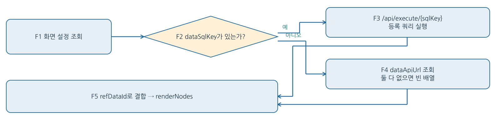

| 연결 단계 | 입력 → 반환 / 화면 반영 | 변경 후 확인 기준 |
| --- | --- | --- |
| F2~F4 | dataSqlKey / dataApiUrl → 화면 데이터 | 쿼리 키·API 경로·반환 형식 확인 |
| F5 | componentType + data → React 화면 요소 | isVisible=false는 생략; 등록표와 타입 일치 |

---

<a id="section-06"></a>

## 06. 여행 기간 선택값을 다음 화면으로 전달

프런트엔드 · S01 / INTRO1

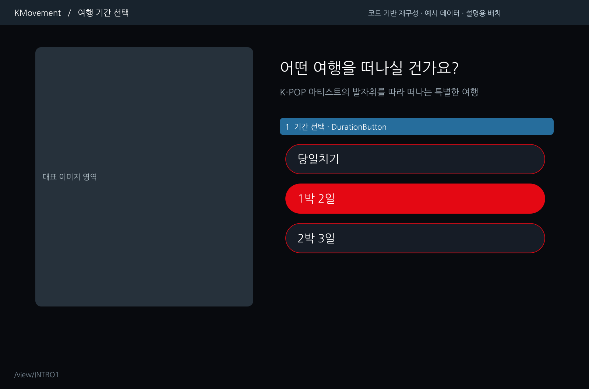

### 기간 버튼

버튼 문구를 코드값으로 바꿉니다. 당일치기 → day, 1박 2일 → onenight, 2박 3일 → twonight.

### 선택 후 이동

DurationButton.handleClick이 onChange와 onAction을 호출합니다. 선택값 갱신 후 INTRO2로 이동합니다.

### 저장 위치

여행 폼은 kride_form에 유지됩니다. 이 버튼 클릭 자체가 일정 생성 요청을 보내지는 않습니다.

| 화면 연결 | 입력 → 처리 | 반환 / 화면 반영 |
| --- | --- | --- |
| S01-1 / DurationButton | meta.labelText → duration 코드값<br>onChange("duration", value) | 이벤트 함수 반환값 없음<br>상태 변경 + 화면 이동 |
| 연결 API / DB | GET /api/ui/KRIDE_INTRO1 | ui_metadata: 화면 문구·버튼·이동 경로 |

---

<a id="section-07"></a>

## 07. 기간 버튼의 선택값과 이동 액션 연결

S01-1 · DurationButton · 핵심 파일과 처리 흐름

| 핵심 파일 | 핵심 기능 · 1~2문장 |
| --- | --- |
| DurationButton.tsx | 버튼 문구를 기간 코드로 바꾸고 입력값 변경 콜백을 호출합니다. 이어서 화면 설정에 있는 다음 화면 이동 액션을 전달합니다. |
| useBaseActions.tsx / useBusinessActions.tsx | 공통 입력 상태를 갱신하고 등록된 저장 키에 보관합니다. LINK 액션은 다음 화면 경로로 이동합니다. |

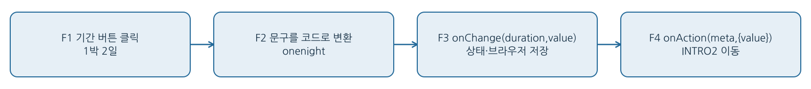

| 연결 단계 | 입력 → 반환 / 화면 반영 | 변경 후 확인 기준 |
| --- | --- | --- |
| F1~F2 | meta.labelText → duration 문자열 | 문구 변경 시 LABEL_TO_VALUE도 확인 |
| F3~F4 | 콜백 반환값 없음 → 상태 저장 + 이동 | 뒤로 가기 후 기간 유지, 다음 화면 경로 확인 |

---

<a id="section-08"></a>

## 08. 아티스트 카드 선택을 추천 조건으로 모으기

프런트엔드 · S02 / INTRO2

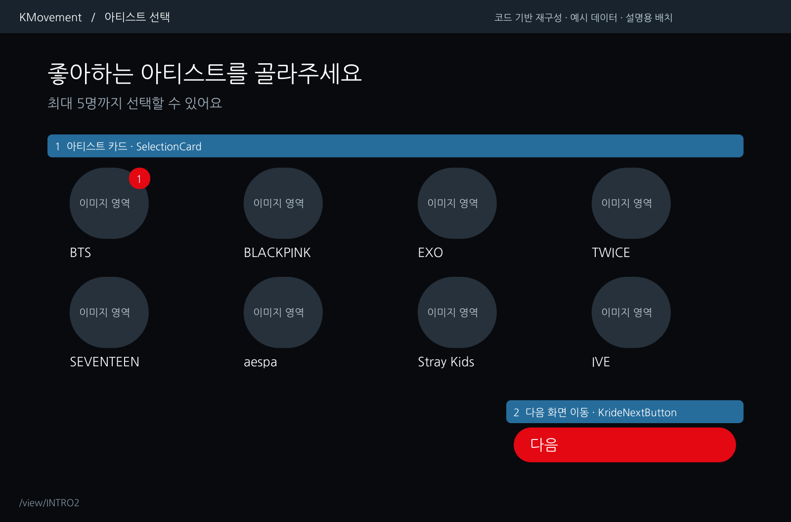

### 선택 카드

data의 id·name·imageUrl과 formData를 받습니다. id로 선택 여부를 판별합니다.

### 선택 제한

같은 카드를 누르면 해제합니다. 아티스트는 최대 5명이며, 한도에 도달하면 나머지 카드는 비활성 상태로 표시됩니다.

### 다음 버튼

KrideNextButton은 checkKey·minCount가 설정된 경우에만 선택 개수를 확인해 표시합니다.

| 화면 연결 | 입력 → 처리 | 반환 / 화면 반영 |
| --- | --- | --- |
| S02-1 / SelectionCard | 카드 데이터 + selectedArtists<br>→ 추가 또는 제거 | onChange("selectedArtists", updated)<br>선택 표시 갱신; 함수 반환값 없음 |
| 연결 API / DB | GET /api/ui/KRIDE_INTRO2<br>POST /api/execute/kride_artist_list | ui_metadata + query_master<br>반환 목록 → artists 그룹의 카드 반복 |

---

<a id="section-09"></a>

## 09. 아티스트 선택·해제·최대 개수를 처리하기

S02-1 · SelectionCard · 같은 카드 재선택과 한도 분기

| 핵심 파일 | 핵심 기능 · 1~2문장 |
| --- | --- |
| SelectionCard.tsx | circle 스타일이면 아티스트 모드로 동작합니다. 선택 객체의 id를 비교해 추가·해제하고 최대 5명까지 허용합니다. |
| KrideNextButton.tsx / useBaseActions.tsx | 다음 버튼은 설정된 최소 개수 조건에 따라 표시됩니다. 입력값은 공통 폼에 저장됩니다. |

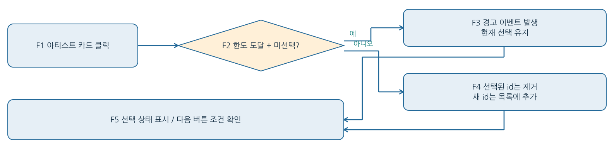

| 연결 단계 | 입력 → 반환 / 화면 반영 | 변경 후 확인 기준 |
| --- | --- | --- |
| F3 | disabled → kride-warning; 조기 종료 | 5명 선택 후 새 카드 차단, 기존 카드는 해제 |
| F4~F5 | updated 배열 → onChange(selectedArtists,updated) | 화면 표시와 요청 artists의 이름 목록 일치 |

---

<a id="section-10"></a>

## 10. 지역 선택을 추천 요청의 지역 이름으로 변환

프런트엔드 · S03 / INTRO3

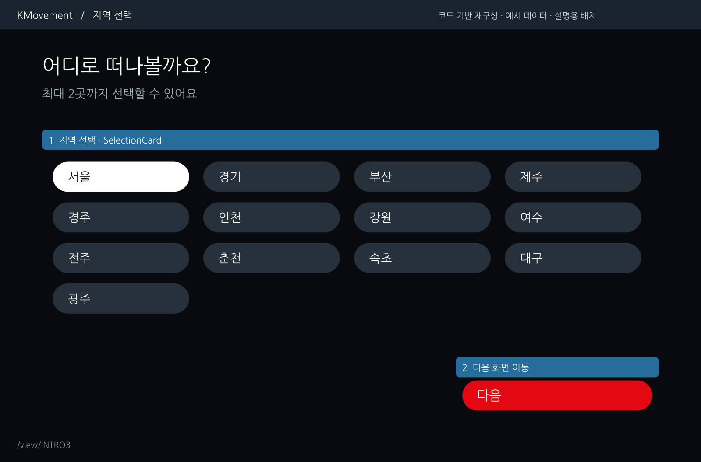

### 지역 카드

SelectionCard가 chip 스타일이면 지역 선택으로 동작합니다. 선택된 지역은 흰색 칩으로 표시합니다.

### 선택값

selectedRegions에 지역 객체를 최대 2개 보관합니다. 이미 고른 지역을 다시 누르면 해제합니다.

### 추천 요청에서 사용

useKrideItinerary가 선택 객체의 name을 추출합니다. 예: [{id:1,name:"서울"}] → regions:["서울"].

| 화면 연결 | 입력 → 처리 | 반환 / 화면 반영 |
| --- | --- | --- |
| S03-1 / SelectionCard | data + formData.selectedRegions<br>→ id 기준 추가 / 제거 | selectedRegions 갱신 → 지역 칩 상태 |
| 연결 API / DB | GET /api/ui/KRIDE_INTRO3<br>POST /api/execute/kride_region_list | ui_metadata + query_master<br>여기서 고른 지역과 TourAPI 지역 코드는 별도 역할 |

---

<a id="section-11"></a>

## 11. 지역 칩과 추천 요청의 지역 이름을 연결

S03-1 · 같은 SelectionCard의 지역 모드

| 핵심 파일 | 핵심 기능 · 1~2문장 |
| --- | --- |
| SelectionCard.tsx | chip 스타일이면 selectedRegions를 사용합니다. 아티스트와 같은 선택 구조를 쓰면서 최대 개수는 2곳으로 적용합니다. |
| useKrideItinerary.ts | 선택한 지역 객체에서 name을 꺼내 regions 문자열 배열로 만듭니다. 장소 탐색의 지역 코드는 별도 입력입니다. |

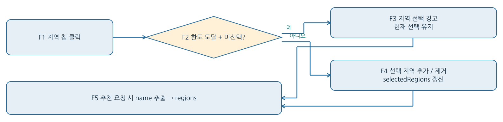

| 연결 단계 | 입력 → 반환 / 화면 반영 | 변경 후 확인 기준 |
| --- | --- | --- |
| F1~F4 | 지역 객체 {id,name,imageUrl} → 선택 객체 배열 | 최대 2곳과 재선택 해제 동작 |
| F5 | [{id:1,name:서울}] → [서울] (설명용 예시) | TourAPI areaCode와 이름 문자열을 구분 |

---

<a id="section-12"></a>

## 12. 여행 목적과 예산을 일정 생성 조건으로 전달

프런트엔드 · S04 / INTRO4 → S05 / INTRO5

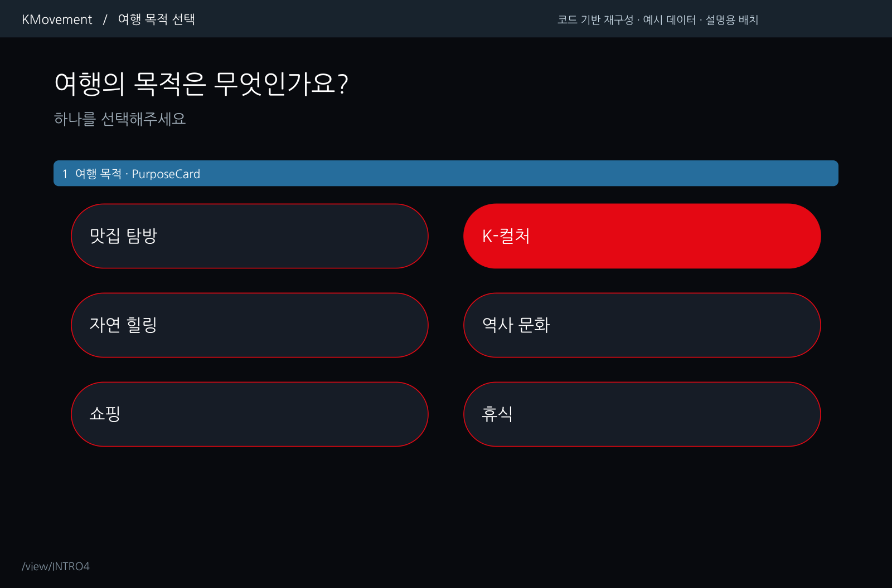

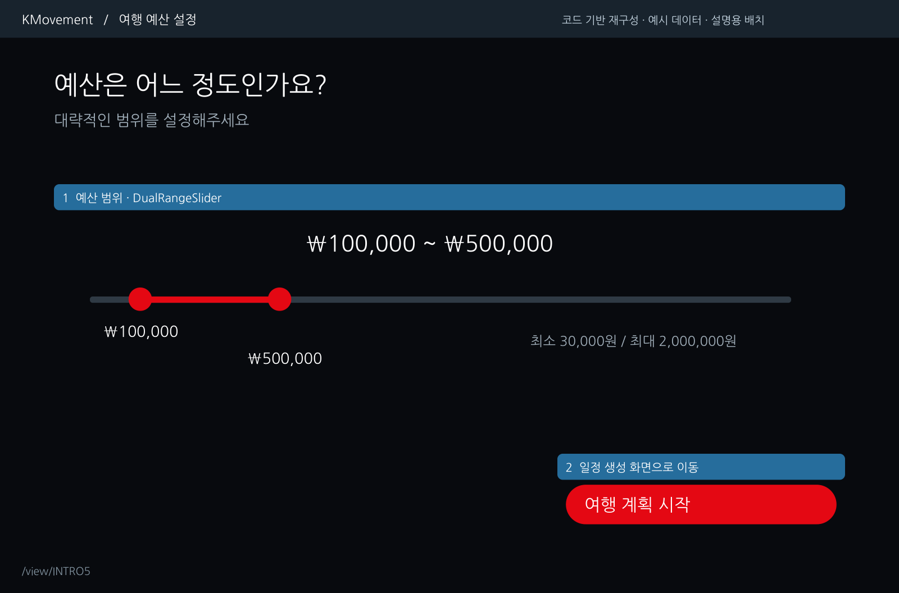

| 화면 요소 | 입력 → 처리 | 반환 / 다음 사용 |
| --- | --- | --- |
| S04-1 / PurposeCard | 목적 키 food·kculture 등 → 선택 시 [key]<br>같은 항목 재선택 시 [] | onChange("purposes", updated)<br>onAction(meta, {value})로 INTRO5 이동 |
| S05-1 / DualRangeSlider | data.budget 또는 기본 범위<br>30,000~2,000,000원, 10,000원 간격 | onChange("budget", {min,max})<br>이벤트 함수는 값을 반환하지 않고 상태 갱신 |
| S05-2 / KrideNextButton | 클릭 → 설정된 /view/FOCUS로 이동<br>화면 설정: GET /api/ui/{screenId} | FOCUS의 추천 훅이 조건을 읽고 요청 시작<br>설정 DB: ui_metadata / 선택값: kride_form |

---

<a id="section-13"></a>

## 13. 목적 카드 선택과 예산 화면 이동

S04-1 · PurposeCard · 입력과 액션을 한 번에 연결

| 핵심 파일 | 핵심 기능 · 1~2문장 |
| --- | --- |
| PurposeCard.tsx | 목적 키를 사람이 읽는 문구로 표시합니다. 클릭하면 목적 배열을 변경하고 설정된 이동 액션을 호출합니다. |
| V53__kride_intro_focus_screens.sql | 목적 카드의 키·문구·이동 경로를 화면 설정에 등록합니다. 동작 변경 시 컴포넌트와 설정을 함께 확인합니다. |

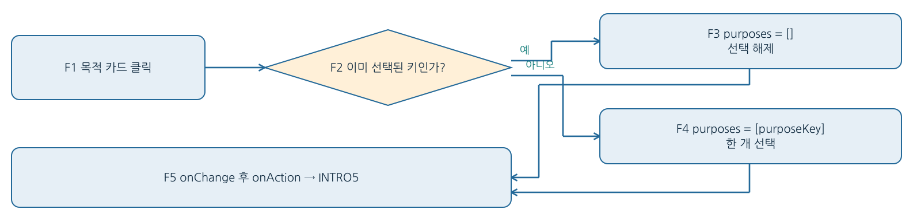

| 연결 단계 | 입력 → 반환 / 화면 반영 | 변경 후 확인 기준 |
| --- | --- | --- |
| F1~F4 | purposeKey / cssClass + purposes → 변경 배열 | food·kculture 등 코드값과 표시 문구 매핑 |
| F5 | 값 변경 콜백 → 액션 콜백; 반환 데이터 없음 | 설정 actionUrl이 예산 화면으로 연결 |

---

<a id="section-14"></a>

## 14. 예산 범위를 보정하고 추천 화면으로 이동

S05-1·2 · DualRangeSlider / KrideNextButton

| 핵심 파일 | 핵심 기능 · 1~2문장 |
| --- | --- |
| DualRangeSlider.tsx | 슬라이더와 직접 입력을 처리합니다. 직접 입력은 범위와 간격에 맞게 보정하고 최소·최대가 뒤집히지 않도록 조정합니다. |
| KrideNextButton.tsx / useKrideItinerary.ts | 계획 시작 버튼은 FOCUS로 이동합니다. 일정 생성은 도착한 화면의 추천 훅이 담당합니다. |

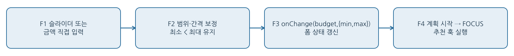

| 연결 단계 | 입력 → 반환 / 화면 반영 | 변경 후 확인 기준 |
| --- | --- | --- |
| F2 | 30,000~2,000,000원 / 10,000원 간격 | 최소·최대 역전, 범위 밖 직접 입력 확인 |
| F3~F4 | budget 객체 → 요청 body.budget | 새로고침 시 저장값과 요청 예산 일치 |

---

<a id="section-15"></a>

## 15. 추천 일정과 지도 마커를 함께 보여주기

프런트엔드 · S06 / FOCUS · 상담창을 닫은 상태

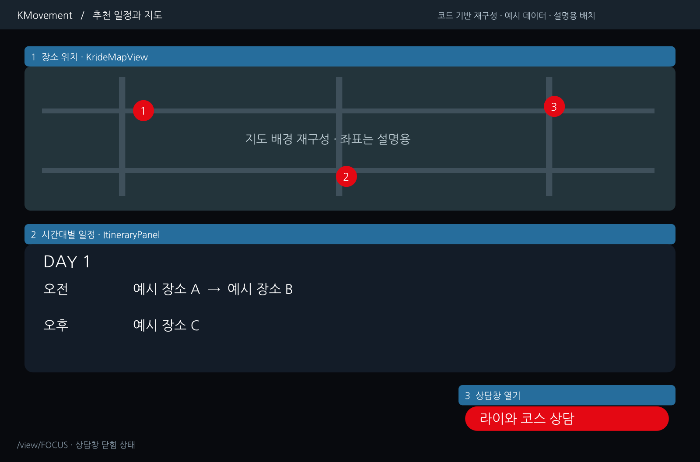

### 지도

useKrideItinerary의 mapData.markers를 전달합니다. 좌표를 확인한 장소가 지도에 표시됩니다.

### 일정 패널

ItineraryPanel은 itinerary와 장소 후보를 받아 일자·오전·오후 단위로 정리합니다. 장소 이름으로 지도 정보를 보완합니다.

### 상담창

진입 시 상담창이 열리며 닫아서 지도를 볼 수 있습니다. 상담 결과는 kride-chat-update 이벤트로 다시 합쳐집니다.

| 화면 연결 | 입력 → 처리 | 반환 / 화면 반영 |
| --- | --- | --- |
| S06-1·2 / 추천 훅 | screenId + formData<br>→ POST /kride-api/recommend/itinerary | {data, isLoading, error}<br>data.itinerary / markers / mapData |
| S06-2 / ItineraryPanel | 여러 일정·장소 데이터 형태를 정규화 | React 화면 반환 → 시간대별 일정<br>추천 이력 저장 경로는 다음 페이지 |

---

<a id="section-16"></a>

## 16. 지도·일정·채팅이 같은 화면 데이터를 공유하는 구조

S06 · 기능별 컴포넌트 의존 관계

| 핵심 파일 | 핵심 기능 · 1~2문장 |
| --- | --- |
| KrideFocusScreen.tsx | 화면 설정, 폼 값, 추천 응답을 합쳐 하위 컴포넌트로 보냅니다. 상담 결과 이벤트도 받아 기존 지도 데이터를 보완합니다. |
| ItineraryPanel.tsx / useKrideItinerary.ts | 일정 패널은 장소·시간대를 정규화해 표시합니다. 추천 훅은 요청 상태와 추천 결과를 돌려줍니다. |

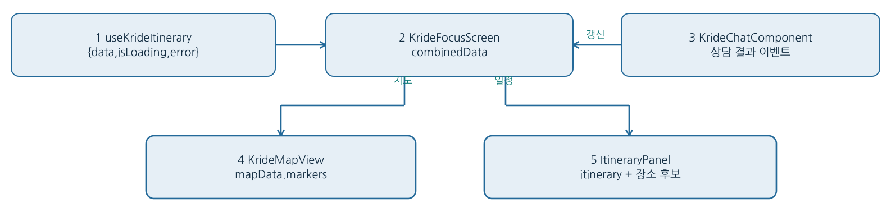

| 핵심 연결 | 입력과 화면 반영 | 유지보수 확인 |
| --- | --- | --- |
| 1 → 2 | 추천 응답 → 화면에서 쓸 통합 데이터 | 로딩·오류·성공 상태 분리 |
| 3 → 2 → 4·5 | kride-chat-update → 폼 병합 → 지도·일정 갱신 | 빈 마커로 기존 마커를 지우지 않는 병합 규칙 |

---

<a id="section-17"></a>

## 17. 일정 생성 요청과 추천 처리 이력의 흐름

백엔드 + 데이터 · S06의 지도와 일정 패널을 채우는 경로

| 단계 / 함수 | 입력 → 처리 | 반환 / 분기 |
| --- | --- | --- |
| 1 추천 요청<br>useKrideItinerary | FOCUS에서 기간·아티스트·지역 중 조건이 있으면 실행<br>duration, artists, regions, purposes, budget 구성 | 조건 없음: 요청 생략<br>전송 실패·중단: 1회 재시도; 빈 일정: 오류 상태 |
| 2 후보 검색<br>recommend_itinerary | ItineraryRequest → 문장에서 지역·목적 보강<br>목적 검색 + 그래프 검색 등으로 장소 후보 수집 | 검색 조건과 모듈 가용 여부에 따라 분기 |
| 3 일정·좌표 구성 | generate_itinerary → 일정 생성<br>resolve_itinerary_markers → 좌표 연결 | itinerary, mapData, unresolvedPlaces 등<br>프런트엔드의 일정·지도에 전달 |
| 4 처리 이력<br>save_user_route_history | 요청·응답·지역 → 이력용 행 생성<br>사용자 식별·익명 허용·저장 설정 확인 | stored와 reason 등을 반환<br>저장 조건에 따라 Supabase / 로컬 파일 / 생략 |

이력 행에 들어가는 주요 필드

| 필드 묶음 | 의미 | 화면과의 연결 |
| --- | --- | --- |
| id / user_id / activity_type | 이력 식별 / 사용자 / 처리 종류 | 일정 자체의 장소 식별자와 구분 |
| visited_regions / recommended_pois | 방문 지역 / 추천 장소 요약 | 추천 결과와 사용자 이력을 연결 |
| request_payload / response_payload | 요청 조건 / 반환 결과의 축약본 | 데이터 처리 이력을 관리 |

기본 일정 훅의 요청에는 사용자 ID가 없습니다. 이력 기록 여부는 사용자 식별과 익명 기록 설정에 따라 결정됩니다. 위 표는 이력 생성 함수의 필드 계약입니다.

---

<a id="section-18"></a>

## 18. 추천 요청의 실행·재시도·완료 조건

S06 · 프런트엔드에서 요청을 시작하는 흐름

| 핵심 파일 | 핵심 기능 · 1~2문장 |
| --- | --- |
| useKrideItinerary.ts | FOCUS 화면이며 기간·아티스트·지역 중 조건이 있을 때 한 번 요청합니다. 통신 중단·네트워크 실패는 한 번 재시도하고 빈 일정은 오류로 처리합니다. |
| fastapi_server.py | 조건을 보강하고 장소 후보로 일정을 생성합니다. 생성한 일정의 위치를 찾아 mapData와 미해결 장소 정보를 함께 반환합니다. |

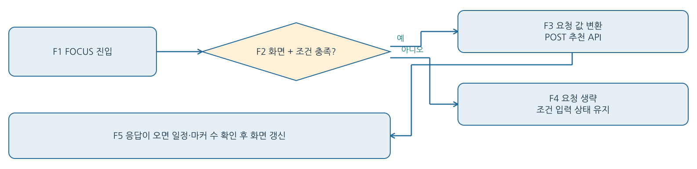

| 연결 단계 | 입력 → 반환 / 화면 반영 | 변경 후 확인 기준 |
| --- | --- | --- |
| F3 | duration·artists·regions·purposes·budget → 일정 응답 | 오류 응답을 정상 빈 화면으로 숨기지 않음 |
| 재시도 분기 | 전송 중단/네트워크 오류 → 1회; 그 외 오류 상태 | isLoading 종료와 error 표시, 빈 일정 검사 |

---

<a id="section-19"></a>

## 19. 추천 처리 이력의 저장 조건과 필드 계약

데이터 계층 · route_history.py · 선택적 기록 흐름

| 핵심 파일 | 핵심 기능 · 1~2문장 |
| --- | --- |
| route_history.py | 요청 조건과 추천 결과를 요약한 이력 행을 만듭니다. 사용자 식별·익명 기록·저장소 설정에 따라 저장하거나 생략합니다. |

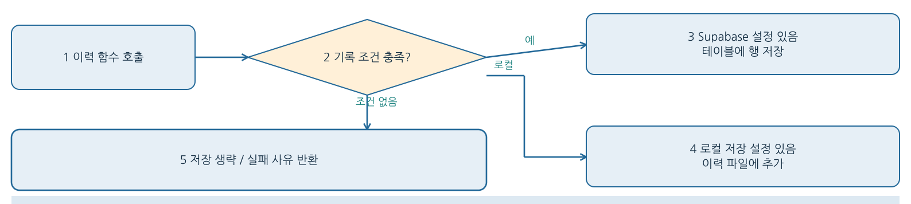

| 저장 필드 계약 | 의미 / 값 형태 | 사용 위치 |
| --- | --- | --- |
| id / user_id / user_sqno | 생성 이력 ID / 사용자 식별 / 숫자 사용자 번호 | 이력 조회와 사용자별 요약 |
| activity_type / activity_date | 처리 종류 / 날짜 문자열 | 추천 종류와 일자 분류 |
| visited_regions / recommended_pois | 지역 배열 / 추천 장소 요약 배열 | 여행 이력과 통계 |
| request_payload / response_payload | 요청·응답의 축약 객체 | 데이터 처리 이력 관리 |

기록 비활성 또는 사용자 식별 조건 미충족이면 생략합니다. Supabase 저장 실패 후 로컬 경로가 있으면 로컬 저장을 시도합니다. 이 표는 저장 함수의 계약입니다.

---

<a id="section-20"></a>

## 20. 채팅 의도에 따라 답변과 일정 갱신을 나누기

프런트엔드 + 백엔드 · S07 / 여행 상담

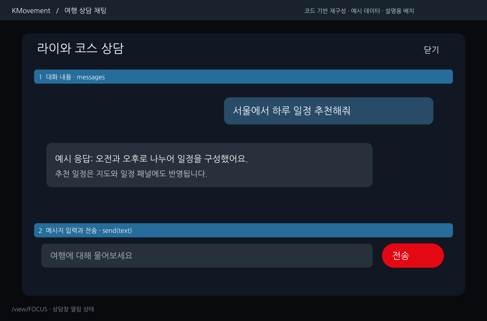

### 입력과 대화 상태

send(text)는 공백 입력과 전송 중 재입력을 걸러낸 뒤 사용자 메시지와 응답 영역을 추가합니다.

### 요청 분기

일반 질문은 연속 응답을 받고, 일정·추천은 단일 응답을 받습니다. 요청에는 여행 폼의 조건도 함께 담습니다.

### 화면에 반영

답변은 messages로, 일정·장소는 kride-chat-update로 전달합니다. FOCUS가 이벤트를 받아 지도·일정을 갱신합니다.

| 화면 연결 | 입력 → 처리 | 반환 / 화면 반영 |
| --- | --- | --- |
| S07-2 / 일반 질문 | POST /api/v1/kride/chat/stream | SSE(Server-Sent Events, 서버 전송 이벤트)<br>content 조각 → 답변 텍스트 누적 |
| S07-2 / 일정·추천 | POST /api/v1/kride/chat<br>KrideChatService.chat(request) | intent·reply·일정 또는 장소 정보<br>이벤트 → formData 및 kride_form |

---

<a id="section-21"></a>

## 21. 질문·추천·일정 요청에 따라 채팅을 분기

S07 · 핵심 파일과 요청 종류별 처리 흐름

| 핵심 파일 | 핵심 기능 · 1~2문장 |
| --- | --- |
| useKrideChatStream.ts | 메시지와 여행 조건으로 요청을 만들고 의도에 맞는 경로를 선택합니다. 일반 답변은 조각 단위로 누적하고 일정 결과는 이벤트로 전달합니다. |
| KrideChatService.java / FastApiChatClient.java | 요청 의도를 확인해 질의응답·장소 추천·일정 생성 함수를 호출합니다. 추천 서버 응답을 채팅 응답 형식으로 정리합니다. |

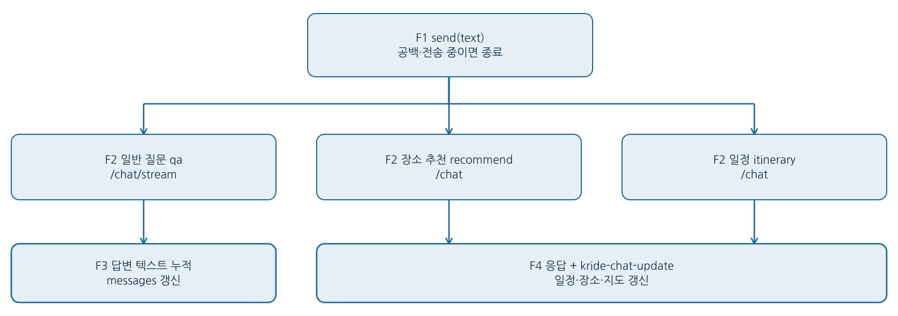

의도 값이 있으면 서버가 그 값을 사용합니다. 없으면 메시지 키워드로 분류합니다. 스트림은 SSE(Server-Sent Events, 서버 전송 이벤트)로 전달합니다.

---

<a id="section-22"></a>

## 22. 지역·카테고리 선택으로 장소 카드를 바꾸기

프런트엔드 · S08 / TOUR_EXPLORE

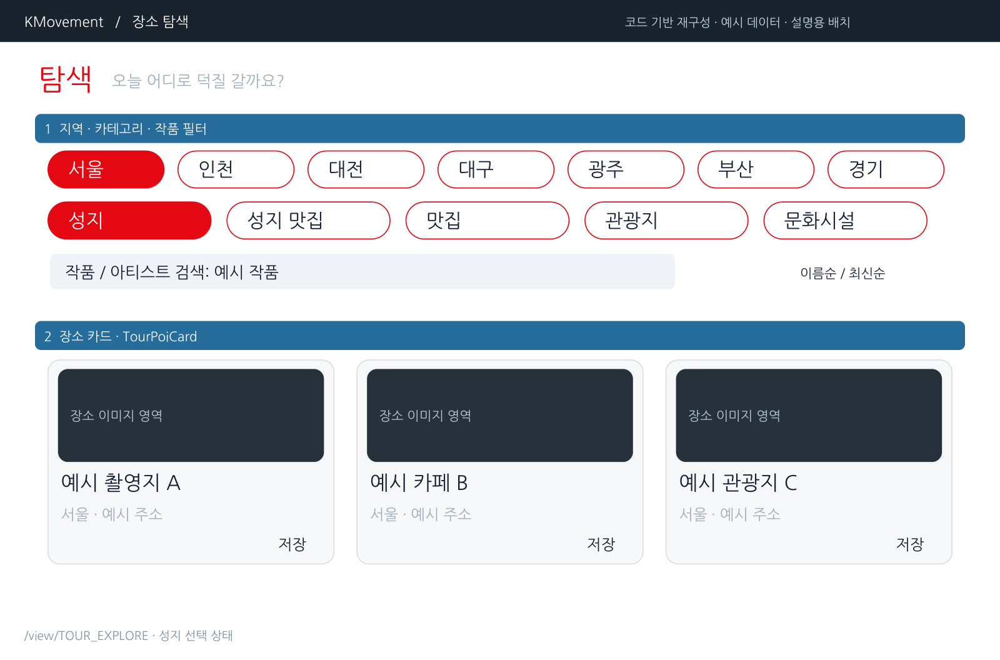

### 조건 선택

지역을 바꾸면 하위 지역 선택을 비웁니다. 성지 계열에서는 작품·아티스트 검색이 추가됩니다.

### 작품 검색

2글자 이상 입력하고 300ms가 지나면 자동완성 목록을 조회합니다. 선택한 contentSqno로 성지를 필터링합니다.

### 카드와 저장

장소를 누르면 상세창을 엽니다. 저장 버튼은 contentId를 브라우저의 kride:saved-pois에 보관합니다.

| 화면 연결 | 입력 → 처리 | 반환 / 화면 반영 |
| --- | --- | --- |
| S08-1 / loadPois | 지역·카테고리·정렬·작품 조건<br>→ fetchHolyPois 또는 fetchTourPois | TourPoi[] → pois → TourPoiCard<br>조건 변경 시 표시 개수 24개로 초기화 |
| S08-2 / toggleSave | contentId → Set에 추가 / 제거 | 상태와 localStorage 갱신<br>이 저장 동작의 서버 DB 호출은 없음 |

---

<a id="section-23"></a>

## 23. 성지와 일반 장소 조회를 나누는 필터 흐름

S08 · TourExploreScreen / tourApi / TourService

| 핵심 파일 | 핵심 기능 · 1~2문장 |
| --- | --- |
| TourExploreScreen.tsx / tourApi.ts | 필터가 바뀌면 표시 개수를 초기화하고 새 목록을 요청합니다. 조회 종류별 요청 파라미터를 구성합니다. |
| TourService.java | 일반 장소는 관광정보 클라이언트로 조회합니다. 성지는 저장된 장소에서 지역·작품·검수 상태·맛집 종류를 적용합니다. |

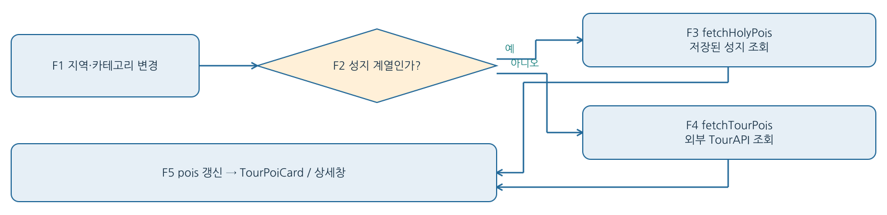

| 연결 단계 | 입력 → 반환 / 화면 반영 | 변경 후 확인 기준 |
| --- | --- | --- |
| F3 오류 | HOLY이면 해당 지역의 내장 목록 사용 | HOLY_FOOD이면 오류 표시 + 목록 비움 |
| F4 오류 | 일반 조회 실패 → 오류 상태 표시 | 지역 변경 시 하위 지역 초기화, 목록 24개 시작 |

---

<a id="section-24"></a>

## 24. 일반 관광정보와 성지 데이터의 조회 경로

백엔드 + DB · S08의 선택 조건별 데이터 연결

| 선택 / 요청 | 백엔드 처리 | 반환 / 데이터 |
| --- | --- | --- |
| 맛집·관광지·문화시설<br>GET /api/v1/tour/poi | TourService.getPois<br>→ tourApiClient.areaBasedList | 외부 TourAPI 결과 → TourPoiDto 목록 |
| 성지·성지 맛집<br>GET /api/v1/tour/holy | TourService.getHolyPois<br>지역·작품·승인 상태·FOOD 조건 적용 | tour_poi + 작품 연결 → HolyPoiDto 목록 |
| 작품 자동완성<br>GET /api/v1/tour/holy/contents | searchHolyContents(q, category, limit) | contentSqno·이름·분류·장소 수 |

ERD(Entity Relationship Diagram, 개체 관계도) · 주요 조회 관계

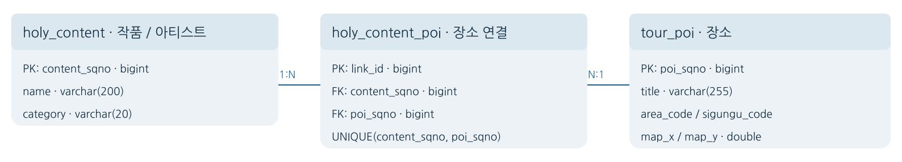

PK(Primary Key, 기본키), FK(Foreign Key, 외래키). 성지 API의 contentSqno는 작품 키입니다. 브라우저 저장의 contentId는 카드 식별값이며, 테이블 기본키 poi_sqno와 역할이 다릅니다.

---

<a id="section-25"></a>

## 25. 성지 스키마의 필드·키·화면 사용 위치

S08 · ERD(Entity Relationship Diagram, 개체 관계도) 상세

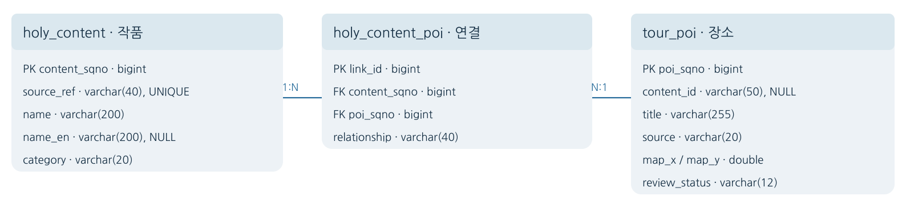

| 필드 / 제약 | 의미 | 화면에서 사용 |
| --- | --- | --- |
| content_sqno / poi_sqno | 작품 키와 장소 키를 연결 | 작품 검색 선택 → 연결된 성지 목록 |
| UNIQUE(content_sqno, poi_sqno) | 같은 작품·장소 연결 중복 방지 | 같은 연결의 중복 생성 방지 |
| content_id의 부분 유일 인덱스 | 값이 있는 외부 장소 번호는 중복 방지 | 카드 contentId와 외부 데이터 연결 |
| map_x / map_y | 경도 / 위도 | 상세창의 지도 열기 |
| review_status / content_type_id | 검수 상태 / 맛집 성지 종류 | 승인된 성지와 성지 맛집 필터 |

PK(Primary Key, 기본키), FK(Foreign Key, 외래키). 실선은 외래키 관계입니다. 장소 1개와 작품 1개에 연결 행이 여러 개 존재할 수 있습니다.

---

<a id="section-26"></a>

## 26. 상품 검색 결과와 사용자 저장 상태를 합치기

프런트엔드 · S09 / KPOP_PRODUCTS

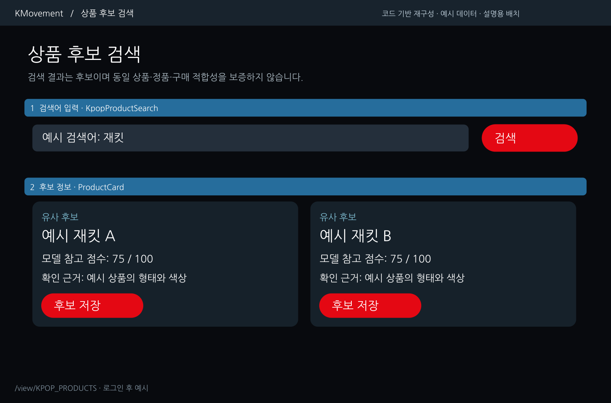

### 검색

KpopProductSearch.search는 q·limit=30으로 상품 후보를 조회하고, 저장 목록도 함께 조회합니다.

### 응답 정리

normalizeCandidate는 camelCase와 snake_case 필드를 통일합니다. 후보 id와 saved_item의 itemRef를 연결합니다.

### 저장 버튼

ProductCard.toggleSaved가 저장 여부에 따라 추가 또는 삭제를 요청합니다. 저장 결과의 ID로 버튼 상태를 바꿉니다.

| 화면 연결 | 입력 → 처리 | 반환 / 화면 반영 |
| --- | --- | --- |
| S09-1 / search | GET /api/v1/kpop/product-candidates<br>GET /api/v1/kpop/saved-items | ProductCandidate[] + 저장 ID<br>→ ProductCard 목록 |
| S09-2 / toggleSaved | POST saved-items: itemType·itemRefId<br>DELETE saved-items/{savedItemId} | 후보 id는 저장 대상, savedItemId는 저장 기록<br>버튼 상태 및 안내 문구 갱신 |

---

<a id="section-27"></a>

## 27. 상품 검색의 병렬 조회와 저장·해제 처리

S09 · 핵심 파일 의존 관계와 상태 변경

| 핵심 파일 | 핵심 기능 · 1~2문장 |
| --- | --- |
| KpopProducts.tsx | 상품 후보와 사용자 저장 목록을 동시에 조회합니다. 후보 키로 저장 기록을 합치고 카드의 저장 상태를 표시합니다. |
| KpopProductService.java | 저장할 대상과 사용자를 확인하고 기록을 추가·삭제합니다. 같은 사용자·종류·대상의 저장은 하나의 기록으로 유지합니다. |

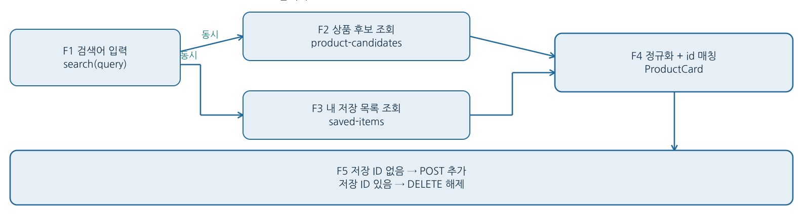

| 핵심 연결 | 입력 → 반환 | 수정 후 확인 |
| --- | --- | --- |
| F2·F3 → F4 | candidate.id ↔ saved.itemRef → savedItemId | 검색 목록과 저장 페이지 상태 일치 |
| F5 | 로그인 사용자 + 대상 ID → 저장 기록 / 삭제 결과 | 중복 저장, 다른 사용자 기록 삭제 방지 |

---

<a id="section-28"></a>

## 28. 상품 후보·저장 기록·분석 결과의 연결

백엔드 + DB · S09 / 저장 버튼이 사용하는 키

| 함수 / 클래스 | 입력 → 처리 | 반환 |
| --- | --- | --- |
| KpopProductService.productCandidates | q, artistId, eventId, limit<br>승인된 카탈로그 검색, 점수와 ID 내림차순 | 후보 목록: id·name·evidenceGrade·confidence 등 |
| KpopProductService.saveItem | payload + 로그인 사용자 번호<br>대상 확인 후 사용자·종류·대상 조합으로 저장 | 저장 기록 Map → 프런트엔드 savedItemId |
| KpopProductService.deleteSavedItem | savedItemId + 사용자 번호<br>해당 사용자의 저장 기록 삭제 | 삭제 결과 Map → 버튼을 후보 저장으로 변경 |

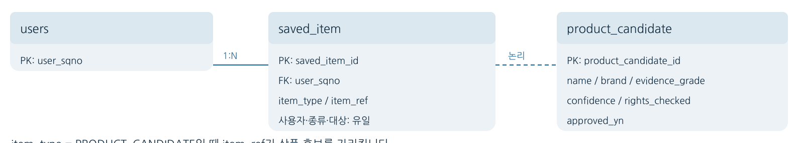

item_type = PRODUCT_CANDIDATE일 때 item_ref가 상품 후보를 가리킵니다.

실선: 외래키 관계. 점선: 서비스에서 확인하는 대상 참조. 분석 기능은 celery_jobs → kpop_analysis_candidate → product_candidate로 결과 후보를 연결합니다.

---

<a id="section-29"></a>

## 29. 상품 카탈로그와 분석 후보를 연결하는 ERD

S09 연계 · 실제 외래키와 서비스의 논리 참조

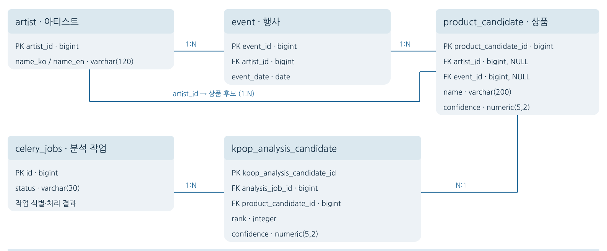

| 제약 | 유지보수 시 의미 |
| --- | --- |
| 분석 작업 + 상품 후보 / 분석 작업 + 순위 유일 | 한 작업에서 후보·순위 중복 방지; 점수 0~100, 순위 &gt; 0 |
| saved_item.item_type + item_ref | 저장 대상은 서비스가 확인하는 논리 참조; 사용자 FK는 별도 |

---

<a id="section-30"></a>

## 30. 커뮤니티 목록과 페이지 이동을 연결

프런트엔드 · S10 / COMMUNITY_LIST

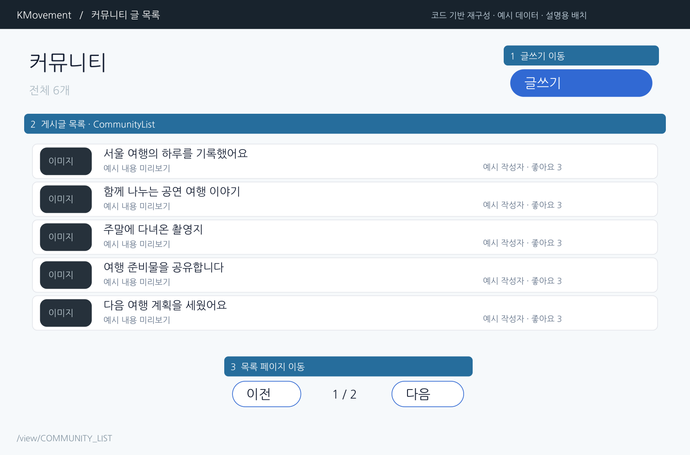

### 목록 조회

CommunityList.loadPosts는 page와 PAGE_SIZE=5를 전달합니다. normalizePage가 응답 형식을 목록과 전체 페이지 수로 정리합니다.

### 상세와 글쓰기

게시글 카드의 postId로 상세 화면을 엽니다. 글쓰기 버튼은 로그인 상태를 확인하고 작성 화면으로 이동합니다.

### 페이지 이동

내부 page는 0부터 시작합니다. 화면 표시는 page+1이며, 마지막 페이지에서는 다음 버튼을 비활성화합니다.

| 화면 연결 | 입력 → 처리 | 반환 / 화면 반영 |
| --- | --- | --- |
| S10-2·3 / loadPosts | GET /api/v1/community/posts<br>page, size=5 | posts / totalPages / totalElements<br>카드 내용·전체 개수·페이지 버튼 |
| 연결 DB | community_post + 작성자 + 이미지 | 목록: 제목·미리보기·닉네임·썸네일<br>상세 데이터는 postId로 별도 조회 |

---

<a id="section-31"></a>

## 31. 게시글 작성·검수 상태·목록 표시의 흐름

S10 · CommunityPage / CommunityPostService

| 핵심 파일 | 핵심 기능 · 1~2문장 |
| --- | --- |
| CommunityPage.tsx / communityService.ts | 목록은 5개씩 요청하고 글·이미지를 작성 요청으로 보냅니다. 작성과 조회의 화면 상태를 따로 관리합니다. |
| CommunityPostService.java | 작성자와 이미지 개수를 확인해 글과 첨부 정보를 저장합니다. 목록에는 삭제되지 않은 승인 글을 반환합니다. |

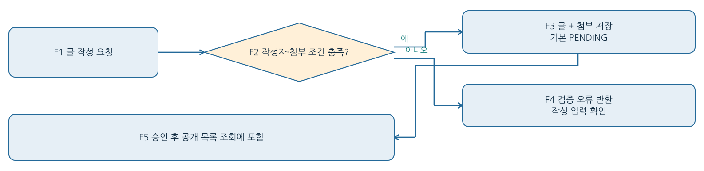

| 연결 단계 | 입력 → 반환 / 화면 반영 | 변경 후 확인 기준 |
| --- | --- | --- |
| F3 | PostResponse → 작성 결과; 검수 상태 유지 | 첨부 최대 10개; 모든 업로드 실패 시 오류 |
| 목록 / 상세 | 목록: del_yn=N + APPROVED<br>미승인 상세: 작성자 또는 관리자 | 작성 직후 목록 미노출은 검수 상태부터 확인 |

---

<a id="section-32"></a>

## 32. 커뮤니티 글과 첨부 이미지·반응 데이터의 관계

백엔드 + DB · S10에서 상세·작성으로 이어지는 데이터

| 요청 | 입력 / 처리 | 반환 |
| --- | --- | --- |
| GET /api/v1/community/posts | page, size → 공개 목록 조회 | Page&lt;PostListResponse&gt; |
| GET /api/v1/community/posts/{postId} | postId → 본문·작성자·첨부 이미지 조합 | PostResponse |
| POST /api/v1/community/posts | multipart/form-data의 글 내용·이미지 + 사용자 | 작성된 PostResponse |
| PATCH 또는 DELETE /posts/{postId} | 작성자 권한과 대상 글을 확인해 수정 / 삭제 | 수정 결과 / 삭제 응답 |

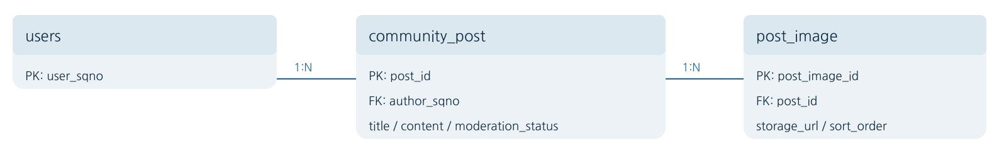

좋아요 post_like, 신고 post_report, 댓글 post_comment도 post_id로 글에 연결됩니다.

새 글의 기본 검수 상태는 PENDING입니다. 실제 공개 여부는 서비스의 조회·권한 조건을 따릅니다. 저장된 이미지 URL은 화면의 썸네일과 본문 이미지로 사용합니다.

---

<a id="section-33"></a>

## 33. 게시글·이미지·댓글·반응을 연결하는 ERD

S10 · 키·필드 타입·중복 제약을 포함한 데이터 구조

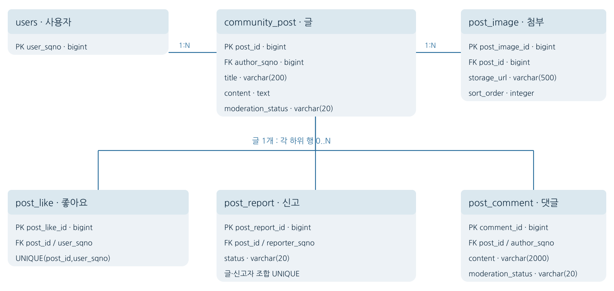

하위 표의 사용자 필드는 users를 참조합니다. post_id 외래키의 삭제 규칙은 CASCADE이며, 실제 삭제 경로에서는 서비스의 삭제 상태·첨부 처리도 함께 확인합니다.

---

<a id="section-34"></a>

## 34. 유지보수에 필요한 실행 환경과 설정

운영 준비 · 설정 파일과 역할을 먼저 확인

| 핵심 파일 | 핵심 기능 · 1~2문장 |
| --- | --- |
| package.json / build.gradle / Dockerfile | 프런트엔드 실행·검증 명령, Java 버전, Python 컨테이너 환경을 정의합니다. 로컬 실행 방식에 맞는 설정 묶음을 사용합니다. |

| 구분 | 저장소에서 확인한 구성 | 준비·확인 |
| --- | --- | --- |
| 프런트엔드 | Next.js 16.1.3 / React 19.2.3<br>자동 검사 Node.js 22, Docker Node.js 20 | 선택한 실행 방식에 맞춰 버전 통일 |
| 업무 서버 | Java 17 / Spring Boot 3.1.4 / Gradle | PostgreSQL·Redis 연결 설정 |
| 추천 서버 | Python 3.11 / FastAPI / Celery | 추천 모델·그래프·목적 검색 데이터 |
| 브라우저 요청 전달 | next.config.ts: FASTAPI_URL 등 | 개발 기본 업무 서버 8080, 추천 서버 8000 |
| 추천 처리 이력 | KRIDE_ROUTE_HISTORY_STORE / LOCAL_PATH<br>KRIDE_ROUTE_HISTORY_CAPTURE_ANONYMOUS | 저장 방식·경로·익명 기록 조건 |
| 화면 외부 서비스 | 관광정보·지도·로그인·이미지 저장 | 사용할 기능의 연결 설정과 허용 주소 |

설정 값은 실행 환경에 넣고 문서에는 변수 이름과 역할만 기록합니다. 이번 문서 작업은 실행 설정 분석이며 서비스 실행 검증 결과를 의미하지 않습니다.

---

<a id="section-35"></a>

## 35. 로컬에서 데이터·업무 서버·화면을 시작하기

Windows PowerShell · 저장소 루트에서 실행하는 유지보수 절차

1  업무 서버와 데이터 서비스

```powershell
docker compose -f subproject/SDUI/docker-compose.yml up -d --build
docker compose -f subproject/SDUI/docker-compose.yml ps
```

2  추천 기능이 필요할 때

```powershell
docker compose -f docker-compose.local.yml up -d --build fastapi
curl.exe -f http://localhost:8000/api/health
```

3  프런트엔드 · 별도 터미널

```powershell
cd subproject/SDUI/metadata-project
npm ci
npm run dev
```

| 실행 단계 | 성공 확인 | 사전 준비 |
| --- | --- | --- |
| 1 업무 서버 | 서비스 실행 후 /api/ui/KRIDE_INTRO1 응답 | DB 연결·프로필·기능별 설정 |
| 2 추천 서버 | health의 status + 그래프·도로 데이터 건수 | 모델·원본 데이터·검색 인덱스 |
| 3 화면 | localhost:3000/view/INTRO1 표시 | 패키지 설치와 요청 전달 대상 |

추천 Dockerfile은 그래프·모델 파일을 복사합니다. 목록 조회와 일정 생성을 각각 확인해야 기능 준비 상태를 판단할 수 있습니다.

---

<a id="section-36"></a>

## 36. 수정 영역에 맞춰 테스트와 빌드를 확인하기

유지보수 검증 · 명령 실행 위치와 성공 기준

| 영역 / 실행 위치 | 명령 예시 | 성공 확인 |
| --- | --- | --- |
| 프런트엔드<br>metadata-project 폴더 | npx jest tests/components/DualRangeSlider.test.tsx --runInBand<br>npm run build | 관련 테스트 통과 + 빌드 완료 |
| Java 업무 서버<br>SDUI-server 폴더 / PowerShell | .\gradlew.bat test --tests "*KpopProductServiceTest"<br>.\gradlew.bat test --tests "*CommunityPostServiceTest" | 저장·삭제·공개 조건 검증 통과 |
| Python 추천<br>저장소 루트 / 환경 활성화 후 | python -m pytest src/api/test_contract.py -q<br>python -m pytest src/api/test_route_history_logging.py -q | 추천 응답 계약·이력 분기 확인 |
| 배포용 화면 빌드<br>PowerShell / metadata-project | $env:FASTAPI_URL="http://localhost:8000"<br>npm run build | 추천 서버 주소가 설정된 빌드 완료 |

수정 완료 판단은 코드 검사와 화면 확인을 함께 사용

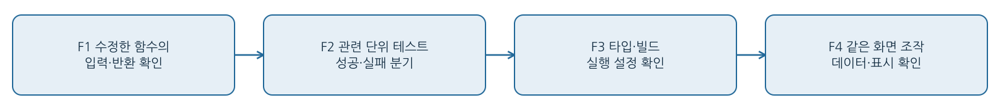

CI(Continuous Integration, 지속적 통합)는 자동 검사 과정입니다. 저장소 ci.yml은 프런트엔드·Java·Python 검사 범위를 각각 정의합니다. 위 명령은 작업별 실행 예시입니다.

---

<a id="section-37"></a>

## 37. 배포 전 확인과 이전 버전 복구 준비

운영 절차 · 자동화 파일의 실제 역할과 권장 확인 순서

| 핵심 파일 | 핵심 기능 · 1~2문장 |
| --- | --- |
| deploy-ec2.yml / deploy.sh | 워크플로가 이미지·포트·환경 설정을 주입한 뒤 배포 스크립트를 실행합니다. 스크립트는 추천 서버 상태와 외부 데이터 연결 등을 점검합니다. |

| 순서 | 작업 | 완료 기준 |
| --- | --- | --- |
| 1 변경 검증 | 관련 테스트와 빌드 결과 확인 | 변경 기능의 성공·실패 화면 확인 |
| 2 복구 자료 확보 | 이전 이미지 식별값·설정·DB 백업 확보 | 기존 스키마와 이전 코드의 호환성 확인 |
| 3 배포 진행 | 프로젝트의 배포 워크플로 사용<br>deploy.sh는 워크플로가 값을 채우는 템플릿 | 대상 버전과 실행 환경 일치 |
| 4 상태·기능 점검 | 추천 health, 화면 설정 조회, 장소 조회<br>저장·해제와 커뮤니티 공개 조건 확인 | 상태 응답과 대표 사용자 흐름 정상 |
| 5 이상 시 복구 | 확보한 이전 이미지·설정으로 복원 후 재검증 | 주요 화면·조회·저장 기능 재확인 |

2번과 5번은 유지보수 권장 절차입니다. DB 변경은 별도 복구 계획이 필요하며 애플리케이션 버전만 되돌려 스키마까지 복구되는 것으로 취급하지 않습니다.

---

<a id="section-38"></a>

## 38. 증상별 확인 순서와 정상 복구 기준

운영 점검 · 화면 → 요청 → 서버 → 저장소 순서로 좁히기

| 증상 | 확인 순서 | 정상 복구 기준 |
| --- | --- | --- |
| 화면 항목이 없음 | 화면 ID → /api/ui 응답 → 역할 필터<br>componentType 등록 → isVisible | 해당 역할에서 예상 요소 표시 |
| 추천 실패 또는 빈 일정 | 요청 body → FastAPI 응답 → 검색 후보 수<br>모델·그래프·목적 검색 데이터 → 좌표 결과 | 일정 장소와 지도 마커가 대응 |
| 지역 변경 결과가 다름 | 지역·카테고리 파라미터 → 성지/일반 분기<br>작품 연결·검수 상태 또는 TourAPI 응답 | 선택 조건에 해당하는 카드 표시 |
| 상품 저장 상태가 안 맞음 | 로그인 사용자 → candidate.id → itemRef<br>POST/DELETE 응답 → savedItemId | 새로고침 후에도 저장 상태 일치 |
| 글 작성 후 목록에 없음 | 작성 응답 → moderation_status → del_yn<br>공개 목록의 page·size | 승인·미삭제 글이 해당 페이지에 표시 |
| 처리 이력이 없음 | 사용자 식별 / 익명 허용 → 저장 설정<br>저장 결과의 stored·reason | 설정된 저장소에서 이력 조회 가능 |

인수인계 시 함께 전달할 항목

실행 환경 설정 목록, 대표 확인 시나리오, 백업·복구 위치, 배포 워크플로, 최근 변경 기능의 테스트 결과를 전달합니다. 비밀값은 별도의 권한 있는 전달 경로를 사용합니다.

---

<a id="section-39"></a>

## 39. 화면 증상에서 수정할 로직을 찾는 순서

유지보수 · 이미지 번호를 코드 위치와 연결하는 활용법

| 화면에서 보이는 증상 | 먼저 확인할 코드 / 데이터 | 연결 페이지 |
| --- | --- | --- |
| 요소가 안 보이거나 순서가 다름 | UiService의 권한 필터 → ui_metadata의 순서·부모<br>renderNodes의 숨김·컴포넌트 등록 | 04–05 |
| 선택값이 추천에 반영되지 않음 | SelectionCard·PurposeCard의 onChange<br>kride_form → useKrideItinerary 요청 변환 | 06–19 |
| 일정은 있는데 지도 위치가 비어 있음 | 반환 mapData·unresolvedPlaces<br>일정 장소와 마커의 이름·좌표 연결 | 15–19 |
| 채팅 후 일정이 갱신되지 않음 | useKrideChatStream의 결과 이벤트<br>KrideFocusScreen의 이벤트 병합 | 20–21 |
| 지역·작품을 바꿔도 장소가 다름 | loadPois의 조회 분기·조건<br>TourService의 성지 필터와 작품 연결 | 22–25 |
| 상품 저장 버튼의 상태가 다름 | candidate.id ↔ saved_item.item_ref<br>savedItemId의 추가·삭제 응답 | 26–29 |
| 글이 목록에 보이지 않음 | 조회 페이지·삭제 상태·검수 상태·조회 권한 | 30–33 |

화면 S01~S10 번호는 이전 이미지 묶음과 동일합니다. 각 화면 뒤의 핵심 파일·흐름도를 함께 확인합니다.

---
