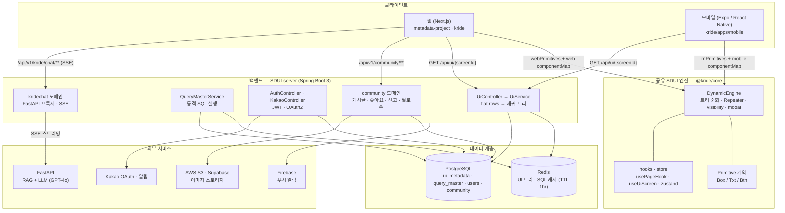
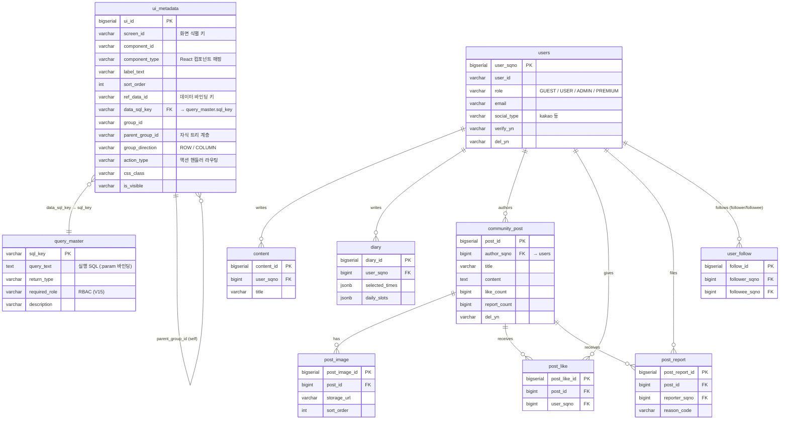
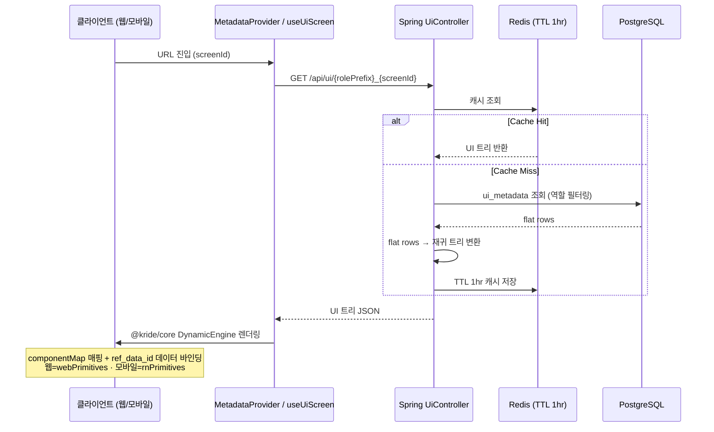
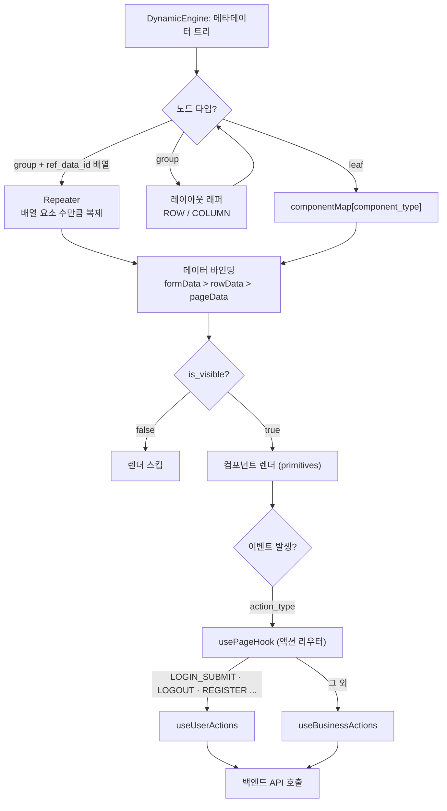
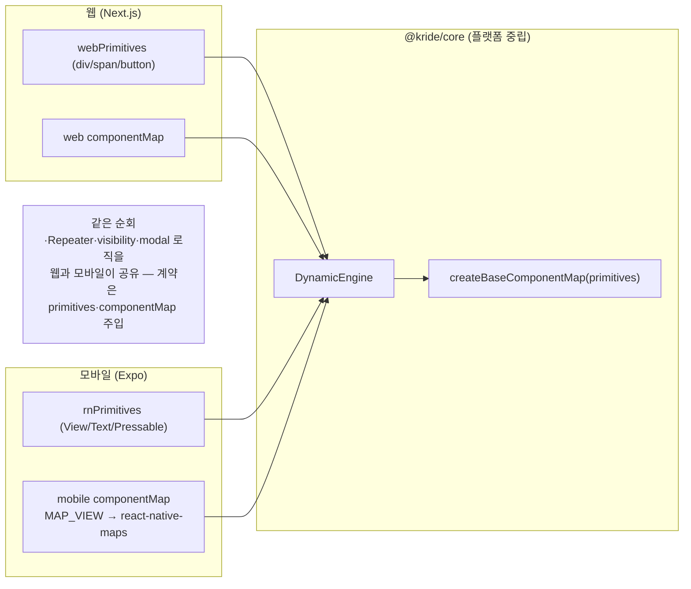

# K-RIDE SDUI — 아키텍처 문서

> 서버 주도 UI(Server-Driven UI) 시스템의 **아키텍처 다이어그램 · ERD · 렌더링 플로우 · 기술 스택**을 한곳에 정리한 문서입니다.
> 개요·기능 설명은 [README.md](README.md)를 참고하세요.

구성 요소:

| 레이어 | 위치 | 스택 |
|--------|------|------|
| 백엔드 | `SDUI-server/` | Spring Boot 3 (Java 17) |
| 웹 프론트 | `metadata-project/`, `kride/` | Next.js 14 (React 18) |
| 모바일 | `kride/apps/mobile/` | Expo 51 (React Native 0.74) |
| 공유 엔진 | `kride/packages/core/` | 플랫폼 중립 SDUI 엔진 (웹·모바일 공유) |
| AI 챗봇 | 외부 FastAPI | RAG + LLM (`kridechat` 도메인이 프록시) |

---

## 1. 시스템 아키텍처 다이어그램

---

## 2. ERD (Entity Relationship Diagram)

> SDUI 메타데이터 테이블(`ui_metadata` / `query_master`)과 도메인 테이블(users, community 등)의 관계입니다.
> 실제 스키마는 `SDUI-server/src/main/resources/db/migration/V*.sql` (Flyway)에서 관리됩니다.

> **별도 DB (FastAPI / Supabase)** — `user_route_history`, `bicycle_paths`, `bicycle_routes`(PostGIS)는 AI 라우팅용 Supabase DB에 있으며 Flyway가 아닌 별도로 관리됩니다. (`db_schema.sql` 참고)

---

## 3. SDUI 렌더링 플로우

### 3-1. 메타데이터 → 화면 렌더링 파이프라인

### 3-2. 컴포넌트 순회 & 액션 라우팅 (엔진 내부)

### 3-3. 웹·모바일 공유 코어 (플랫폼 주입 구조)

---

## 4. 기술 스택 (Tech Stack)

### 백엔드 — `SDUI-server` (Spring Boot 3, Java 17)

| 분류 | 기술 |
|------|------|
| Core | Spring Boot 3.1.4, Spring Web / WebFlux, Spring AOP |
| 인증/인가 | Spring Security, JWT (jjwt 0.11.5), OAuth 2.0 (Kakao) |
| 데이터 접근 | Spring Data JPA, MyBatis 3.0.3, PageHelper, PostgreSQL |
| 마이그레이션 | Flyway (V1 ~ V52+) |
| 캐시 | Spring Data Redis (UI 트리 · SQL 결과 캐시) |
| 실시간 | WebSocket (STOMP), SSE (챗봇 스트리밍) |
| 외부 연동 | AWS S3 (SDK v2), Google Cloud Document AI, Firebase Admin, 나이스 SMS(nurigo), 메일 |
| 회복탄력성 | Resilience4j (서킷 브레이커) |
| 문서화 | springdoc-openapi (Swagger UI) |
| 테스트 | JUnit 5, Spring Security Test, H2, embedded-redis |

### 웹 프론트 — `metadata-project` · `kride`

| 분류 | 기술 |
|------|------|
| Core | Next.js 14 (App Router), React 18, TypeScript 5 |
| 상태 관리 | Zustand, TanStack Query (React Query) |
| 지도 | Leaflet, react-leaflet |
| 스타일 | Tailwind CSS, daisyUI |
| PWA | next-pwa (Service Worker, 홈화면 설치) |
| 테스트 | Jest + React Testing Library, Playwright (E2E), MSW |

### 모바일 — `kride/apps/mobile` (Expo)

| 분류 | 기술 |
|------|------|
| Core | Expo SDK 51, React Native 0.74, expo-router (파일 기반 라우팅) |
| 스타일 | NativeWind 4.1.x (Tailwind for RN) |
| 상태/데이터 | TanStack Query, Zustand |
| 지도 | react-native-maps |
| 저장소 | expo-secure-store, AsyncStorage |

### 공유 엔진 — `kride/packages/core`

| 분류 | 기술 |
|------|------|
| 엔진 | 플랫폼 중립 DynamicEngine · componentMap · screenMap |
| hooks | usePageHook · useUiScreen · useBusinessActions (router 어댑터 주입) |
| store | zustand (onboarding-store 등) |
| 계약 | Primitive(Box/Txt/Btn) · ComponentRegistry 주입 |

### 인프라 & DevOps

| 분류 | 기술 |
|------|------|
| 웹 배포 | Vercel |
| 백엔드 배포 | AWS EC2 + GitHub Actions |
| 로컬 인프라 | Docker Compose (PostgreSQL 5433, Redis 6379, backend 8080) |
| AI 서비스 | FastAPI (RAG + LLM), 별도 배포 |

---

_생성: SDUI 아키텍처 정리 · Mermaid 다이어그램은 GitHub에서 자동 렌더링됩니다._
